# Communicatie over personen binnen de zorg

## Overzicht casussen en oplossingsrichtingen

Voor de casussen binnen de zorg zijn twee domeinen te onderscheiden; het
burgerdomein en het zorg-zorg domein. Per domein zijn er casussen die
uitgewerkt worden. Per casus worden vier oplossingsrichtingen uitgewerkt. De
oplossingsrichtingen die in dit document uitgewerkt worden zijn:

1. Meer diensten BSN gerechtigd maken. 
2. Gegevens uitwisseling op basis van één pseudoniem. 
3. Gegevens uitwisseling op basis van een uniek pseudoniem per niet BSN gerechtigde dienst. 
4. Gegevens uitwisseling op basis van tokens die een beperkte levensduur hebben.

Enkel optie 4 voldoet aan alle gestelde voorwaarden. De andere opties zijn
uitgewerkt om te laten zien wat door de verschillende maatregelen geborgd wordt.

De casussen die behandeld worden zijn:

- Casussen relevant voor niet BSN gerechtigde diensten
    1. Authenticatie van burger. 
    2. Ophalen zorggegevens. 
    3. Lokalisatie. 
- Casussen specifiek voor BSN gerechtigde
    1. Zorgaanbieder registreert en/of raadpleegt gegevens bij lokalisatie dienst. 
- Casussen relevant voor migratie
    1. Pseudoniem rouleren van één dienst. 
    2. Pseudoniemen rouleren van alle diensten. 
    3. Vasthouden ovan het oude pseudoniemen naast de nieuwe. 
    4. Koppelen oude en nieuwe pseudoniemen. 
    5. Lokalisatie migratie naar nieuwe versie 

## Terminologie

- **NBGD:** Niet-BSN-gerechtigde dienst
- **BGD:** BSN-gerechtigde dienst
- **PRS-TT:** PRS - Transport token: Gebruik om naar andere dienst te sturen *(kortlevend)*
- **PRS-AK:** PRS - Access key: Gebruik door NBGD om via PRS-TT te verkrijgen *(langlevend)*

## Ontwerp doelstellingen

Het uitwisselen van informatie in de zorg heeft een specifieke uitdaging. Dit is
dat een datalek immateriële schade kan veroorzaken vanwege de privacy gevoelige
aard van de data. Deze schade kan tot ver in de toekomst doorwerken. Ook kan
deze schade niet (altijd) hersteld worden door een monetaire vergoeding.

Ook zijn er veel verschillende partijen betrokken bij informatie-uitwisselingen
in de zorg. Een ontwerp zal, na implementatie, vanwege inertie in de sector niet
snel gewijzigd kunnen worden. Dit maakt het noodzakelijk om, voor zover
mogelijk, direct het ontwerp te kiezen dat zowel toekomstige flexibiliteit biedt
als maximaal privacy beschermend is. Hierbij moet er vanuit gegaan worden dat er
datalekken plaats zullen vinden bij een of meer van de betrokken systemen.

Bovenstaande uitgangspunten resulteren in de onderstaande doelstellingen:

- Waar mogelijk het gevolg van datalekken minimaliseren
- Beperk verkeerd gebruik van de systemen
- Borg privacy zoveel mogelijk via techniek
- Maak het systeem toekomst bestendig
    - Minimaliseer implementatie afhankelijkheden
    - Zorg voor aanpasbaarheid van onderliggende cryptografie (crypto-agility)
    - Maak eventuele migraties mogelijk en praktisch

## Oplossingsrichtingen

Om communicatie over personen binnen de zorg mogelijk te maken zijn er in dit
document vier scenario's uitgewerkt. Per optie wordt in dit hoofdstuk een
toelichting gegeven bij de opties.

Enkel de laatste optie voldoet aan alle voorwaarden zoals eerder gesteld. Door
wel alle varianten uit te werken valt duidelijk te zien waar (technische)
complexiteit geïntroduceerd wordt en welk doel dit dient.

### Meer diensten BSN gerechtigd maken

In deze *oplossing* krijgen diensten als een PGO en het toestemmings- of
lokalisatieregister een mogelijkheid om het BSN te verwerken.

### Gegevens uitwisseling op basis van één pseudoniem

Voor deze *oplossing* wordt er gewerkt met een zorg-breed pseudoniem. Elke
dienst krijgt voor een specifieke burger hetzelfde pseudoniem. Uitwisseling vindt
plaats op basis van het pseudoniem.

### Gegevens uitwisseling op basis van een uniek pseudoniem per niet BSN gerechtigde dienst

Bij deze *oplossing* wordt er voor elke burger een uniek pseudoniem gemaakt bij
elke dienst. Hierdoor zijn de nummers van verschillende diensten niet zonder
hulp van een ander systeem aan elkaar te relateren. In dit scenario wordt
uitgegaan van het delen van dit pseudoniem met andere diensten wanneer over een
burger gecommuniceerd wordt.

Dienst A kan dan dus een pseudoniem van dienst B ontvangen (wanneer dienst B dit
naar A verstuurd). Ook is er in deze opzet een centraal koppelregister nodig
waarin alle pseudoniemen gekoppeld worden aan het BSN.


### Gegevens uitwisseling op basis van tokens die een beperkte levensduur hebben

Dit is de **oplossing** die tegemoet komt aan alle gestelde criteria. Deze
oplossing heeft als aanvulling op de vorige dat diensten, met uitzondering van
een centrale pseudoniemen dienst, geen informatie krijgen over elkaars
pseudoniemen.

## Fictieve voorbeelden

Bij sommige casussen zal een fictief voorbeeld geven worden. Voor dit fictieve
voorbeeld wordt onderstaande informatie gebruikt.

Er zijn twee burgers:
- Burger K met BSN 1111
- Burger P met BSN 2222

Burger met BSN 1111 maakt gebruik van twee zorgaanbieders en twee PGO’s:
- Apoth 1 en Huisarts 1.
- PGO 1 en  PGO 2

Burger met BSN 2222 maakt ook gebruik van twee zorgaanbieders en één PGO:
- Apoth 1 en Huisarts 3.
- PGO 2


Voor deze burgers staan (mogelijk) onderstaande gegevens in het
toestemmingsregister voor niet BSN gerechtigde service. Dit is afhankelijk van
de casus.


Toestemmingsregister (casus 1)

| BSN  | zorgaanbieder | PGO / Lokali. |
| ---- | ------------- | ------------- |
| 1111 | Apoth 1       | PGO 1         |
| 1111 | Huisarts 1    | x             |
| 1111 | Apoth 1       | PGO 2         |
| 1111 | Huisarts 1    | PGO 2         |
| 1111 | Apoth 1       | Lokali        |
| 1111 | Huisarts 1    | Lokali        |
| 2222 | Apoth 1       | PGO 2         |
| 2222 | Huisarts 1    | PGO 2         |
| 2222 | Apoth 1       | Lokali        |
| 2222 | Huisarts 1    | Lokali        |


Toestemmingsregister (casus 2)

| Pseudoniem | zorgaanbieder | PGO / lokali |
| ---------- | ------------- | ------------ |
| aaaa       | Apoth 1       | PGO 1        |
| aaaa       | Huisarts 1    | x            |
| aaaa       | Apoth 1       | PGO 2        |
| aaaa       | Huisarts 1    | PGO 2        |
| aaaa       | Apoth 1       | Lokali       |
| aaaa       | Huisarts 1    | Lokali       |
| bbbb       | Apoth 1       | PGO 2        |
| bbbb       | Huisarts 1    | PGO 2        |
| bbbb       | Apoth 1       | Lokali       |
| bbbb       | Huisarts 1    | Lokali       |

Toestemmingsregister (casus 3 en 4)

| Pseudoniem | Zorgaanbieder | PGO / lok |
| ---------- | ------------- | --------- |
| A3         | Apo 1         | PGO 1     |
| A3         | Huisarts 1    | x         |
| A3         | Apoth 1       | PGO 2     |
| A3         | Huisarts 1    | PGO 2     |
| A3         | Apoth 1       | Lokali    |
| A3         | Huisarts 1    | Lokali    |
| B2         | Apo 1         | PGO 2     |
| B2         | Huisarts 3    | PGO 2     |
| B2         | Apoth 1       | Lokali    |
| B2         | Huisarts 1    | Lokali    |


Voor deze burgers staan (mogelijk) onderstaande gegevens in het centraal
koppelregister. Dit is afhankelijk van de casus. 

Er is geen centraal koppelregister voor casus 1 en casus 4.


Centraal koppelregister (casus 2)

| BSN  | Dienst   | Pseudoniem |
| ---- | -------- | ---------- |
| 1111 | PGO 1    | aaaa       |
| 1111 | PGO 2    | aaaa       |
| 1111 | Toestem. | aaaa       |
| 1111 | Lokali.  | aaaa       |
| 2222 | PGO 2    | bbbb       |
| 2222 | Toestem. | bbbb       |
| 2222 | Lokali.  | bbbb       |

Centraal koppelregister (casus 3)

| BSN  | Zorgdienst | Pseudoniem |
| ---- | ---------- | ---------- |
| 1111 | PGO 1      | A1         |
| 1111 | PGO 2      | A2         |
| 1111 | Toestem.   | A3         |
| 1111 | Lokali     | A4         |
| 2222 | PGO 2      | B1         |
| 2222 | Toestem.   | B2         |
| 2222 | Lokali     | B3         |


Voor deze burgers staan (mogelijk) onderstaande gegevens in het centraal
koppelregister. Dit is afhankelijk van de casus. 

Lokalisatieregister (casus 1)

| BSN  | Zorgaanbieder |
| ---- | ------------- |
| 1111 | Apoth 1       |
| 1111 | Huisarts 1    |
| 2222 | Apoth 3       |
| 2222 | Huisarts 1    |


Lokalisatieregister (casus 2)

| BSN  | Zorgaanbieder |
| ---- | ------------- |
| aaaa | Apoth 1       |
| aaaa | Huisarts 1    |
| bbbb | Apoth 3       |
| bbbb | Huisarts 1    |


Lokalisatieregister (casus 3 en 4)

| Pseudoniem | Zorgaanbieder |
| ---------- | ------------- |
| A4         | Apoth 1       |
| A4         | Huisarts 1    |
| B3         | Apoth 3       |
| B3         | Huisarts 1    |

# Casussen relevant voor niet BSN gerechtigde

## Casus 1: Authenticatie van burger

Hieronder wordt beschreven hoe de authenticatie van een burger verloopt bij de
vier oplossingsrichtingen.

### Oplossingsrichting 1: Meer diensten BSN gerechtigd maken

#### Omschrijving

In deze oplossingsrichting worden diensten zoals PGO en bijvoorbeeld het
toestemmingsregister BSN gerechtigde diensten. Hierdoor kunnen deze diensten
DigiD gebruiken om de burger te authentiseren en het BSN van de burger op te
halen. 

#### Fictief voorbeeld

In dit voorbeeld is de BGD (ofwel de BSN gerechtigde dienst) PGO 1. Deze kan in
dit voorbeeld ook vervangen worden PGO 2 of het toestemmingsregister. Deze casus
gaat in alle gevallen enkel om het inloggen bij een dienst (authenticatie), niet
om de acties in het systeem (bijvoorbeeld toestemmingen wijzigen).

#### Sequentiediagram

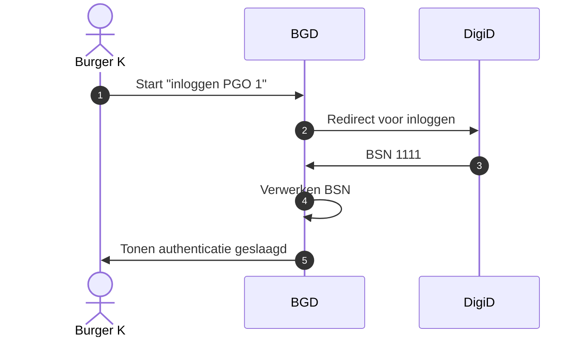


### Oplossingsrichtingen 2: Gegevens uitwisseling op basis van één pseudoniem 

#### Omschrijving

Diensten als PGO en het toestemmingsregister (toekomstige versie) zijn **geen**
BSN gerechtigde diensten. Deze niet BSN gerechtigde diensten hebben daarom een
alternatief nodig voor het BSN met betrekking tot de identificatie van de
burger; een pseudoniem. 

In deze casus wordt er van uit gegaan dat het pseudoniem nog niet bestaat. Het
laten aanmaken van deze pseudoniem, valt binnen de casus authenticatie, omdat
deze nodig is voor alle verder (medische) gegevens uitwisselingen. 

Het aangemaakte pseudoniem wordt ter registratie aangeboden bij de dienst die
het centrale koppelregister beheert. Hier kan deze pseudoniem door andere
diensten weer uitgehaald worden voor gebruik.

In deze casus hebben alle zorgdiensten het zelfde pseudoniem. 

#### Fictief voorbeeld

Burger K start voor het eerste PGO 1 op. Voor deze burger zijn nog nooit
pseudoniemen aangemaakt. Na het doorlopen van de flow van onderstaande
sequentiediagram staat de volgende informatie in het centrale koppelregister
voor burger B.
 
In dit voorbeeld is de NGBD (ofwel de niet BSN gerechtigde dienst) PGO 1. Maar
kan hier ook PGO 2, het toestemmingsregister of een andere NGBD.

Betreffende het toestemmingsregister, het gaat hier over het inloggen bij het
toestemmingsregister door de burger om zijn toestemmingen aan te passen. Het
betreft hier niet de service die de toestemmingen ophaalt en toont. 

Centraal koppelregister

| BSN  | Dienst   | Generiek pseudoniem |
| ---- | -------- | ------------------- |
| 1111 | PGO 1    | aaaa                |


#### Sequentiediagram

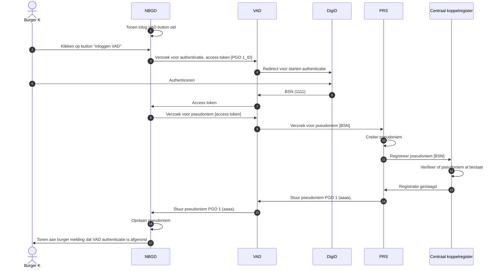

Wanneer burger K zijn toestemmingen wil aanpassen in het toestemmingsregister
zal hij dezelfde flow doorlopen en zal er na afloop onderstaande in het centraal
koppelregister staan.


Centraal koppelregister

| BSN  | Dienst   | Generiek pseudoniem |
| ---- | -------- | ------------------- |
| 1111 | PGO 1    | aaaa                |
| 1111 | Toestem. | aaaa                |
| 1111 | Dienst X | aaaa                |

Versimpelde versie

| BSN  | Generiek pseudoniem |
| ---- | ------------------- |
| 1111 | aaaa                |

### Oplossingsrichtingen 3: Gegevens uitwisseling op basis van een uniek pseudoniem per niet BSN gerechtigde dienst


#### Omschrijving

Oplossing 3 verschilt van oplossingsrichting 2 doordat diensten een pseudoniem
krijgen wat specifiek is per dienst (i.p.v. een pseudoniem die voor alle diensten
hetzelfde is). 

### Fictief voorbeeld 

Burger K start voor het eerste PGO 1 op. Voor deze burger zijn nog nooit
pseudoniemen aangemaakt. Na het doorlopen van de flow van onderstaande
sequentiediagram staat de volgende informatie in het centrale koppelregister
voor burger K.
 
In dit voorbeeld is de NGBD (ofwel de niet BSN gerechtigde dienst) PGO 1. Maar
kan hier dus ook PGO 2 zijn, of het toestemmingsregister waar de burger zijn
toestemmingen kan aanpassen.

Betreffende het toestemmingsregister, het gaat hier over het inloggen bij het
toestemmingsregister door de burger om zijn toestemmingen aan te passen. Het
betreft hier niet de service die de toestemmingen ophaalt en toont. 

Centraal koppelregister

| BSN  | Dienst | Pseudoniem |
| ---- | ------ | ---------- |
| 1111 | PGO 1  | A1         |


#### Sequentiediagram

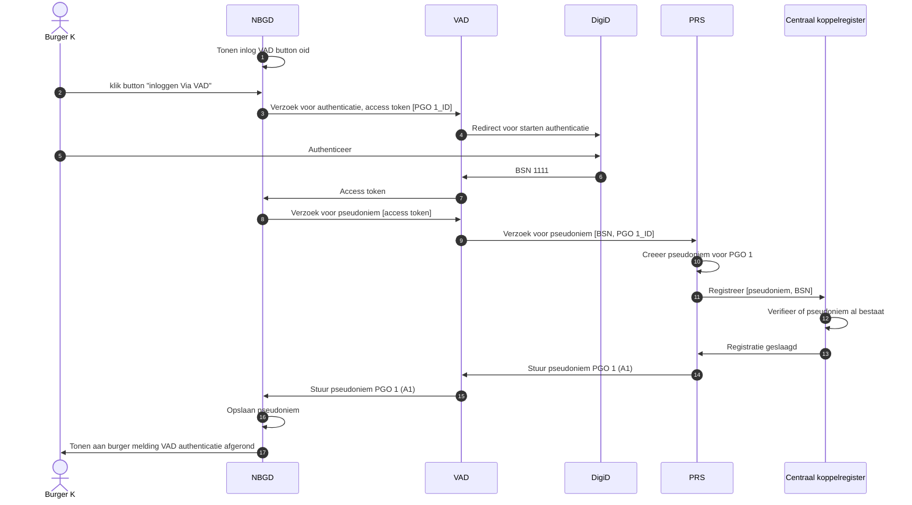

Wanneer burger K zijn toestemmingen wil aanpassen in het toestemmingsregister
zal hij dezelfde flow doorlopen en zal er na afloop onderstaande in het centraal
koppelregister staan.

Centraal koppelregister

| BSN  | Dienst   | Pseudoniem |
| ---- | -------- | ---------- |
| 1111 | PGO 1    | A1         |
| 1111 | Toestem. | A3         |
| 1111 | Dienst X | Ax         |

### Oplossingsrichting 4: Gegevens uitwisseling op basis van tokens die een beperkte levensduur hebben

#### Omschrijving 

Deze oplossingsrichting heeft twee aanvullende beschermingsvoordelen, in
vergelijking met voorgaande oplossingsrichting:

1. Diensten hebben onderling geen kennis van elkaars pseudoniemen
2. Er is geen centraal koppelregister meer nodig

### Fictief voorbeeld 

Burger K start voor het eerste PGO 1 op. Voor deze burger zijn nog nooit
pseudoniemen aangemaakt. 
 
In dit voorbeeld is de NGBD (ofwel de niet BSN gerechtigde dienst) PGO 1. Maar
kan hier dus ook PGO 2 zijn, of het toestemmingsregister waar de burger zijn
toestemmingen kan aanpassen.

Betreffende het toestemmingsregister, het gaat hier over het inloggen bij het
toestemmingsregister door de burger om zijn toestemmingen aan te passen. Het
betreft hier niet de service die de toestemmingen ophaalt en toont. 

#### Sequentiediagram

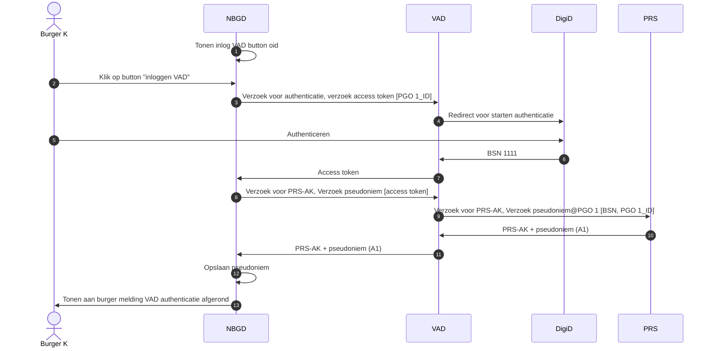


## Casus 2: Ophalen zorggegevens

### Oplossingsrichting 1: Meer diensten BSN gerechtigd maken

#### Omschrijving

In deze oplossing hebben alle diensten beschikking over het BSN. Deze  BSN kan
gebruikt worden om (medische) gegevens op te halen. 

In deze casus wordt er vanuit gegaan dat:
1.	Authenticatie heeft plaatsgevonden
2.	Dat de burger toestemmingen heeft gegeven voor:
    - Automatische lokalisatie
    - Het ophalen van gegevens bij de bron


#### Fictief voorbeeld

Burger met BSN 1111 maakt gebruik van twee zorgaanbieders (Apoth 1 en Huisarts
1) en van twee PGO’s (PGO 1 en PGO 2).  De burger heeft aangegeven dat PGO 1
alleen de gegevens van de apotheek mag ophalen en dat PGO 2 zowel de gegevens
van de apotheek als de huisarts mag ophalen. 

In dit voorbeeld is de BGD (ofwel wel BSN gerechtigde dienst) PGO 1. Maar kan hier dus ook PGO 2 zijn. 

Toestemmingsregister


| BSN  | zorgaanbieder | PGO / Lokali. |
| ---- | ------------- | ------------- |
| 1111 | Apoth 1       | PGO 1         |
| 1111 | Huisarts 1    | x             |
| 1111 | Apoth 1       | PGO 2         |
| 1111 | Huisarts 1    | PGO 2         |

Het zorgaanbieder ID is verkregen gedurende een eerder proces genaamd
(geautomatiseerde) lokalisatie. 

#### Sequentiediagram
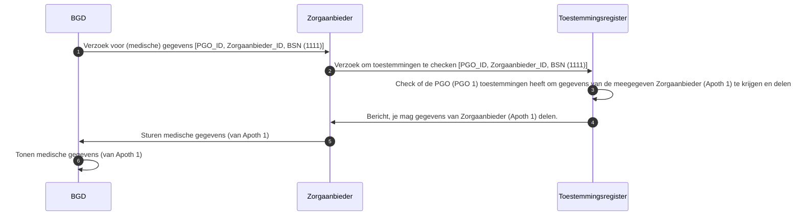

### Oplossingsrichting 2: Gegevens uitwisseling op basis van één pseudoniem

#### Omschrijving

Bij het gebruik van een zorgbreed pseudoniem (één pseudoniem voor alle diensten)
wordt dit gebruikt voor het ophalen van zorggegevens.

In deze casus wordt er vanuit gegaan dat:

1. Authenticatie heeft plaatsgevonden
2. Dat de burger toestemmingen heeft gegeven voor:
    - Automatische lokalisatie
    - Het ophalen van gegevens bij de bron
3. Dat een pseudoniem voor de burger al aanwezig is in het centraal
   koppelregister (zie authenticatie)

### Fictief voorbeeld

Burger met BSN 1111 maakt gebruik van twee zorgaanbieders (Apoth 1 en Huisarts
1) en van twee PGO’s (PGO 1 en PGO 2).  De burger heeft aangegeven dat PGO 1
alleen de gegevens van de apotheek mag ophalen en dat PGO 2 zowel de gegevens
van de apotheek als de huisarts mag ophalen. 

In dit voorbeeld is de BGD (ofwel wel BSN gerechtigde dienst) PGO 1. Maar kan
hier dus ook PGO 2 zijn. 

Toestemmingsregister

| Pseudoniem | zorgaanbieder | PGO / lokali |
| ---------- | ------------- | ------------ |
| aaaa       | Apoth 1       | PGO 1        |
| aaaa       | Huisarts 1    | x            |
| aaaa       | Apoth 1       | PGO 2        |
| aaaa       | Huisarts 1    | PGO 2        |


Centraal koppelregister

| BSN  | Dienst   | Pseudoniem |
| ---- | -------- | ---------- |
| 1111 | PGO 1    | aaaa       |
| 1111 | PGO 2    | aaaa       |
| 1111 | Toestem. | aaaa       |
| 1111 | Lokali.  | aaaa       |


Versimpelde versie centraal koppelregister

| BSN  | Generiek pseudoniem |
| ---- | ------------------- |
| 1111 | aaaa                |

Het zorgaanbieder ID is verkregen gedurende een eerder proces genaamd
(geautomatiseerde) lokalisatie. 

#### Sequentiediagram
 ```mermaid
sequenceDiagram
autonumber

NBGD ->> Zorgaanbieder: Verzoek voor (medische) gegevens [PGO_ID, Zorgaanbieder_ID's, pseudoniem (aaa)]
Zorgaanbieder ->> Toestemmingen: Verzoek om toestemmingen te checken [PGO_ID, Zorgaanbieder_ID, pseudoniem (aaa)] 
Toestemmingen ->> Toestemmingen: Check of de PGO (PGO 1) toestemmingen heeft om gegevens van de meegegeven Zorgaanbieder (Apoth 1) te krijgen en delen
Toestemmingen ->> Zorgaanbieder: Bericht, je mag gegevens van Zorgaanbieder (Apoth 1) delen
Zorgaanbieder ->> Centraal koppelregister: Verzoek voor BSN [pseudoniem (aaaa)]
Centraal koppelregister ->> Centraal koppelregister: Bepaal welke BSN bij verkregen pseudoniem hoort.
Centraal koppelregister  ->> Zorgaanbieder: BSN (1111)
Zorgaanbieder ->> NBGD: Sturen medische gegevens van Apoth 1
NBGD ->> NBGD: Tonen medische gegevens van Apoth 1
```

### Oplossingsrichting 3: Gegevens uitwisseling op basis van een uniek pseudoniem per niet BSN gerechtigde dienst

#### Omschrijving

Deze oplossingsricting heeft als aanvulling op de vorige oplossingsrichting dat
er nu een uniek pseudoniem per dienst gebruikt wordt.

In deze casus gaan we er van uit dat:

1. Authenticatie heeft plaats gevonden
2. Dat de burger toestemmingen heeft gegeven voor:
    - Automatische lokalisatie
    - Het ophalen van gegevens bij de bron
3. Dat de dienst specifieke pseudoniemen voor de burger aanwezig zijn in het
   centrale koppelregister

#### Fictief voorbeeld

Burger met BSN 1111 maakt gebruik van twee zorgaanbieders (Apoth 1 en Huisarts
1) en van twee PGO’s (PGO 1 en PGO 2).  De burger heeft aangegeven dat PGO 1
alleen de gegevens van de apotheek mag ophalen en dat PGO 2 zowel de gegevens
van de apotheek als de huisarts mag ophalen. 

In dit voorbeeld is de BGD (ofwel wel BSN gerechtigde dienst) PGO 1. Maar kan
hier dus ook PGO 2 zijn. 

Toestemmingsregister

| Pseudoniem | Zorgaanbieder | PGO / lok |
| ---------- | ------------- | --------- |
| A3         | Apo 1         | PGO 1     |
| A3         | Huisarts 1    | x         |
| A3         | Apoth 1       | PGO 2     |
| A3         | Huisarts 1    | PGO 2     |
| A3         | Apoth 1       | Lokali    |
| A3         | Huisarts 1    | Lokali    |


Centraal koppelregister

| BSN  | Zorgdienst | Pseudoniem |
| ---- | ---------- | ---------- |
| 1111 | PGO 1      | A1         |
| 1111 | PGO 2      | A2         |
| 1111 | Toestem.   | A3         |
| 1111 | Lokali     | A4         |


#### Sequentiediagram

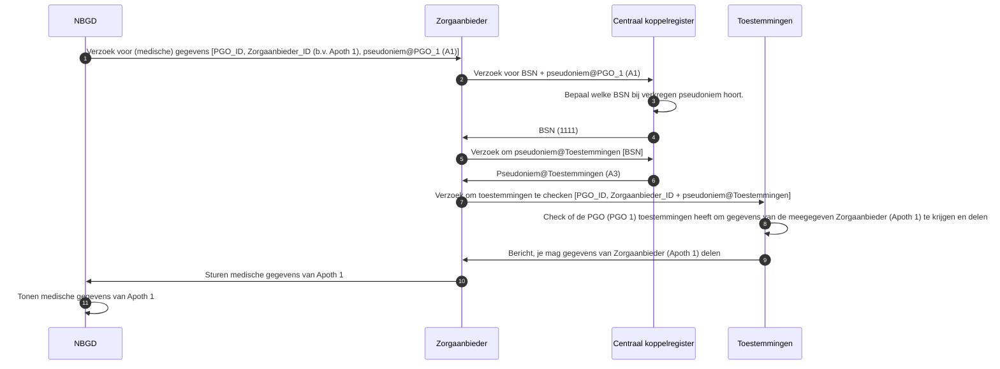

### Oplossingsrichting 4: Gegevens uitwisseling op basis van tokens die een beperkte levensduur hebben.

#### Omschrijving

In aanvulling op optie 3 maakt deze oplossing het mogelijk voor diensten om met
elkaar te communiceren zonder elkaars pseudoniem te leren.

In deze casus gaan we er van uit dat:

1. Authenticatie heeft plaats gevonden
2. Dat de burger toestemmingen heeft gegeven voor:
    - Automatische lokalisatie
    - Het ophalen van gegevens bij de bron
3. De zorgaanbieder een koppeltabel heeft van pseudoniem naar BSN

#### Fictief voorbeeld

Burger met BSN 1111 maakt gebruik van twee zorgaanbieders (Apoth 1 en Huisarts
1) en van twee PGO’s (PGO 1 en PGO 2).  De burger heeft aangegeven dat PGO 1
alleen de gegevens van de apotheek mag ophalen en dat PGO 2 zowel de gegevens
van de apotheek als de huisarts mag ophalen. 

In dit voorbeeld is de BGD (ofwel wel BSN gerechtigde dienst) PGO 1. Maar kan
hier dus ook PGO 2 zijn.

Toestemmingsregister <br>

| Pseudoniem | Zorgaanbieder | PGO / lok |
| ---------- | ------------- | --------- |
| A3         | Apo 1         | PGO 1     |
| A3         | Huisarts 1    | x         |
| A3         | Apoth 1       | PGO 2     |
| A3         | Huisarts 1    | PGO 2     |
| A3         | Apoth 1       | Lokali    |
| A3         | Huisarts 1    | Lokali    |


#### Sequentiediagram

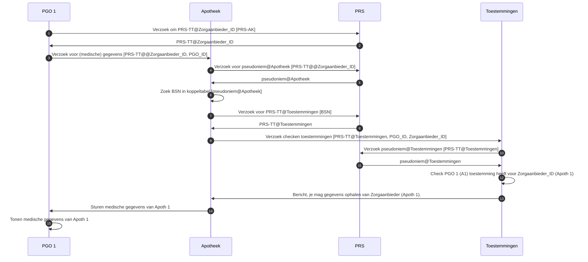


## Casus 3: Automatische lokalisatie


Hieronder wordt casus 3 beschreven voor de 4 oplossingsrichtingen. Dit geeft de
opbouw in privacy beschermende maatregelen weer voor de verschillende
oplossingsrichtingen.

Zorggegevens van een burger staan bij meerdere zorgaanbieders geregistreerd. Om
een "broadcast" te voorkomen is een lokalisatieregister gewenst. Dit register
registreert per burger welke zorgaanbieders over data van die burger beschikken.

### Oplossingsrichting 1: Meer diensten BSN gerechtigd maken

#### Omschrijving

In deze casus gaan we er vanuit dat zowel de PGO als het lokalisatieregister BSN gerechtigde diensten zijn. 

#### Fictief voorbeeld

Burger met BSN 1111 maakt gebruik van twee zorgaanbieders (Apoth 1 en Huisarts
1) en van twee PGO’s (PGO 1 en PGO 2).  De burger heeft aangegeven dat PGO 1
alleen de gegevens van de apotheek mag ophalen en dat PGO 2 zowel de gegevens
van de apotheek als de huisarts mag ophalen. 

Het terugleveren van alleen de zorgaanbiedergegevens door het
lokalisatieregister waar toestemming voor is, is niet weergegeven in
onderstaande sequentie diagram.

Lokalisatieregister <br>

| BSN  | Zorgaanbieder |
| ---- | ------------- |
| 1111 | Apoth 1       |
| 1111 | Huisarts 1    |
| 2222 | Apoth 3       |
| 2222 | Huisarts 1    |


#### Sequentiediagram

 ```mermaid
sequenceDiagram
autonumber

PGO ->> Lokalisatie register: Verzoek om zorgaanbieders voor burger [BSN]
Lokalisatie register ->> PGO: Zorgaanbieders (Apoth 1)
```

### Oplossingsrichting 2: Gegevens uitwisseling op basis van één pseudoniem 

#### Omschrijving

In deze casus gaan we er vanuit dat zowel de PGO als het lokalisatieregister
niet BSN gerechtigde diensten zijn. 


#### Fictief voorbeeld

Burger met BSN 1111 maakt gebruik van twee zorgaanbieders (Apoth 1 en Huisarts
1) en van twee PGO’s (PGO 1 en PGO 2).  De burger heeft aangegeven dat PGO 1
alleen de gegevens van de apotheek mag ophalen en dat PGO 2 zowel de gegevens
van de apotheek als de huisarts mag ophalen. 

Het terugleveren van alleen de zorgaanbiedergegevens door het
lokalisatieregister waar toestemming voor is, is niet weergegeven in
onderstaande sequentie diagram.

Lokalisatieregister <br>

| BSN  | Zorgaanbieder |
| ---- | ------------- |
| aaaa | Apoth 1       |
| aaaa | Huisarts 1    |
| bbbb | Apoth 3       |
| bbbb | Huisarts 1    |

Centraal koppelregister

| BSN  | Dienst   | Pseudoniem |
| ---- | -------- | ---------- |
| 1111 | PGO 1    | aaaa       |
| 1111 | PGO 2    | aaaa       |
| 1111 | Toestem. | aaaa       |
| 1111 | Lokali.  | aaaa       |
| 2222 | PGO 2    | bbbb       |
| 2222 | Toestem. | bbbb       |
| 2222 | Lokali.  | bbbb       |

De PGO heeft het pseudoniem van de zorgdienst al bij de authenticatie opgehaald.

#### Sequentiediagram

 ```mermaid
sequenceDiagram
autonumber

PGO ->> Lokalisatie register: Verzoek om zorgaanbieders voor burger [pseudoniem (aaa)]
Lokalisatie register ->> PGO: Zorgaanbieders (Apoth 1 en Huisarts 1)
```

### Oplossingsrichting 3: Gegevens uitwisseling op basis van een uniek pseudoniem per niet BSN gerechtigde dienst. 
 
#### Omschrijving 

In deze oplossing is het lokalisatieregister zo ontworpen dat het zelf geen BSN
bevat. Dit voorkomt dat bij een datalek deze gegevens direct tot identificatie
van personen kan leiden. Partijen die pseudoniemen voor andere kunnen maken, of
datalekken die koppelingen bevatten van identificerende gegevens met dienst
specifieke pseudoniemen, kunnen leiden tot herleidbaarheid.

#### Fictief voorbeeld

Burger met BSN 1111 maakt gebruik van twee zorgaanbieders (Apoth 1 en Huisarts
1) en van twee PGO’s (PGO 1 en PGO 2).  De burger heeft aangegeven dat PGO 1
alleen de gegevens van de apotheek mag ophalen en dat PGO 2 zowel de gegevens
van de apotheek als de huisarts mag ophalen. 

Het terugleveren van alleen de zorgaanbiedergegevens door het
lokalisatieregister waar toestemming voor is, is niet weergegeven in
onderstaande sequentie diagram.

Lokalisatieregister

| Pseudoniem | Zorgaanbieder |
| ---------- | ------------- |
| A4         | Apoth 1       |
| A4         | Huisarts 1    |
| B3         | Apoth 3       |
| B3         | Huisarts 1    |

Centraal koppelregister

| BSN  | Dienst   | Pseudoniem |
| ---- | -------- | ---------- |
| 1111 | PGO 1    | A1         |
| 1111 | PGO 2    | A2         |
| 1111 | Toestem. | A3         |
| 1111 | Lokali.  | A4         |
| 2222 | PGO 2    | B1         |
| 2222 | Toestem. | B2         |
| 2222 | Lokali.  | B3         |

De PGO heeft het pseudoniem van de zorgdienst al bij de authenticatie opgehaald.

#### Sequentiediagram
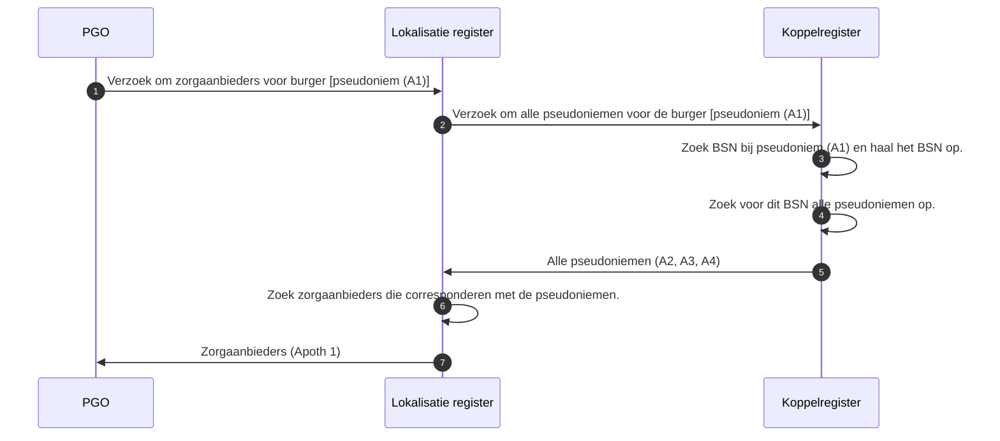

### Oplossingsrichting 4: Gegevens uitwisseling op basis van tokens die een beperkte levensduur hebben.


#### Omschrijving 
 
In deze oplossing is het lokalisatieregister zo ontworpen dat het zelf geen BSN
bevat. Dit voorkomt dat bij een datalek deze gegevens direct tot identificatie
van personen kan leiden. Partijen die pseudoniemen voor andere kunnen maken, of
datalekken die koppelingen bevatten van identificerende gegevens met dienst
specifieke pseudoniemen, kunnen leiden tot herleidbaarheid.

#### Fictief voorbeeld

Burger met BSN 1111 maakt gebruik van twee zorgaanbieders (Apoth 1 en Huisarts
1) en van twee PGO’s (PGO 1 en PGO 2).  De burger heeft aangegeven dat PGO 1
alleen de gegevens van de apotheek mag ophalen en dat PGO 2 zowel de gegevens
van de apotheek als de huisarts mag ophalen. 

Het terugleveren van alleen de zorgaanbiedergegevens door het
lokalisatieregister waar toestemming voor is, is niet weergegeven in
onderstaande sequentie diagram.

Lokalisatieregister

| Pseudoniem | Zorgaanbieder |
| ---------- | ------------- |
| A4         | Apoth 1       |
| A4         | Huisarts 1    |
| B3         | Apoth 3       |
| B3         | Huisarts 1    |


Genereren pseudoniemen door PRS

PRS genereerd kan een pseundoniem genereren bijvoorbeeld op basis van de
volgende gegegensset: PGO 1_ID + BSN

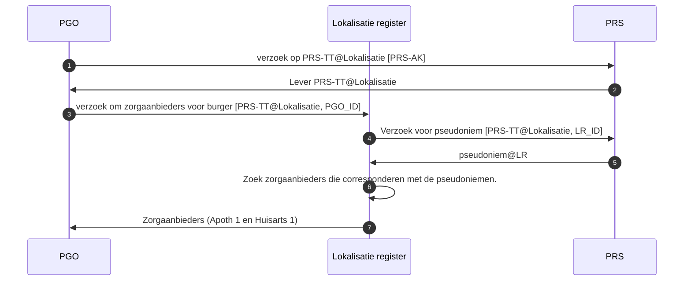


# Casussen relevant voor BSN gerechtigde

## Casus 1: Zorgaanbieder registreert en/of raadpleegt gegevens bij lokalisatie dienst

### Oplossingsrichting 1: Meer partijen BSN gerechtigd maken

#### Omschrijving

In het lokalisatieregister staat voor elke burger geregistreert bij wie hij zorg
afneemt of heeft afgenomen. Wanneer een burger zich meldt bij een nieuwe
zorgaanbieder, moet deze zorgaanbieder deze burger registreren in het
lokalisatieregister. 

Zowel de arts als de lokatieregister leverancier zijn in deze casus BSN-gerechtigde.

#### Fictief voorbeeld 1a: Zorgaanbieder registreert gegevens in lokalisatie dienst

Burger K meldt zicht aan bij een nieuwe huisarts. De huisarts registreert deze
burger in zijn eigen systeem (BGP) en stuurt deze gegevens door naar het
lokalisatieregister.

Lokalisatieregister

| BSN  | Zorgaanbieder |
| ---- | ------------- |
| 1111 | Apoth 1       |
| 1111 | Huisarts 1    |
| 1111 | Huisarts 2    |


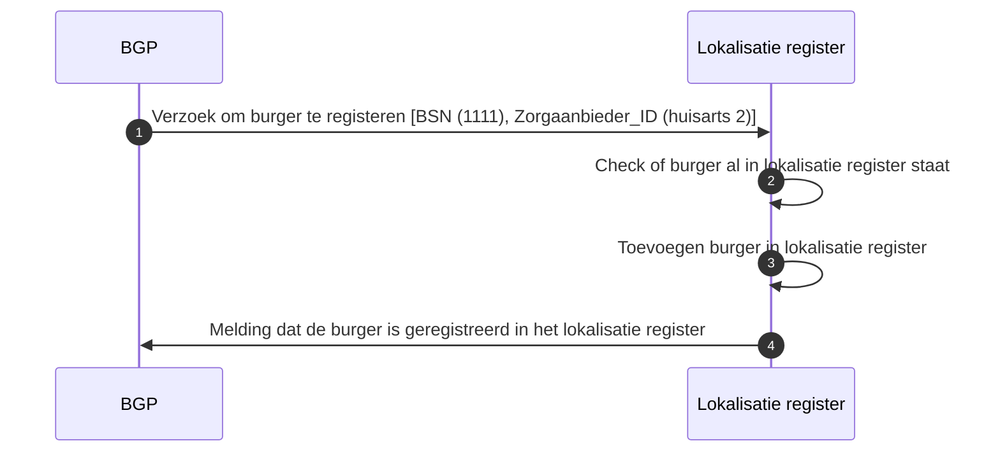

#### Fictief voorbeeld 1b: Zorgaanbieder wil zien waar burger allemaal zorg afneemt

De nieuwe huisarts van burger K wil graag zien waar burger K in het verleden
zorg af heeft genomen, ofwel de zorggeschiedenis van burger K.  

Lokalisatieregister

| BSN  | Zorgaanbieder |
| ---- | ------------- |
| 1111 | Apoth 1       |
| 1111 | Huisarts 1    |
| 1111 | Huisarts 2    |


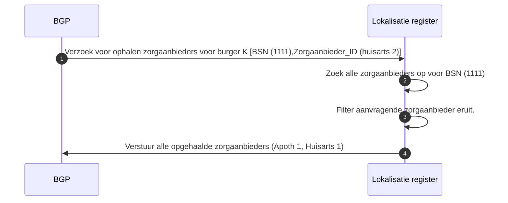

### Oplossingsrichting 2: Gegevens uitwisseling op basis van één pseudoniem 

De arts is BSN gerechtigd in deze casus maar de lokalisatieregister leverancier
niet. Hierdoor kent het lokalisatieregister alleen pseudoniemen. Deze
pseudoniemen zijn per burger voor alle zorgdiensten hetzelfde. 

#### Fictief voorbeeld 1a Zorgaanbieder registreert gegevens in lokalisatie dienst

Burger K meldt zicht aan bij een nieuwe huisarts. De huisarts registreert deze
burger in zijn eigen systeem (BGP) en stuurt deze gegevens door naar het
lokalisatieregister.

Lokalisatieregister

| Pseudoniem | Zorgaanbieder |
| ---------- | ------------- |
| aaaa       | Apoth 1       |
| aaaa       | Huisarts 1    |
| aaaa       | Huisarts 2    |
| bbbb       | Apoth 3       |

Centraal koppelregister

| BSN  | Dienst   | Pseudoniem |
| ---- | -------- | ---------- |
| 1111 | PGO 1    | aaaa       |
| 1111 | PGO 2    | aaaa       |
| 1111 | Toestem. | aaaa       |
| 1111 | Lokali.  | aaaa       |

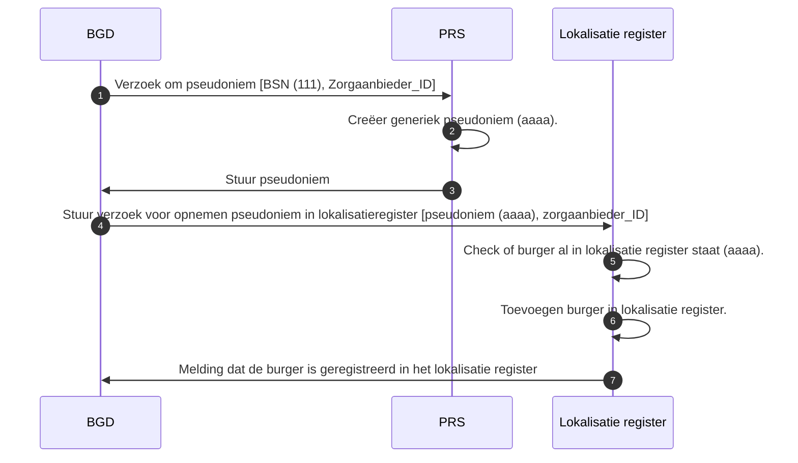
#### Fictief voorbeeld 1b Zorgaanbieder wil zien waar burger allemaal zorg afneemt

De nieuwe huisarts van burger K wil graag zien waar burger K in het verleden
zorg af heeft genomen, ofwel de zorggeschiedenis van burger K. 


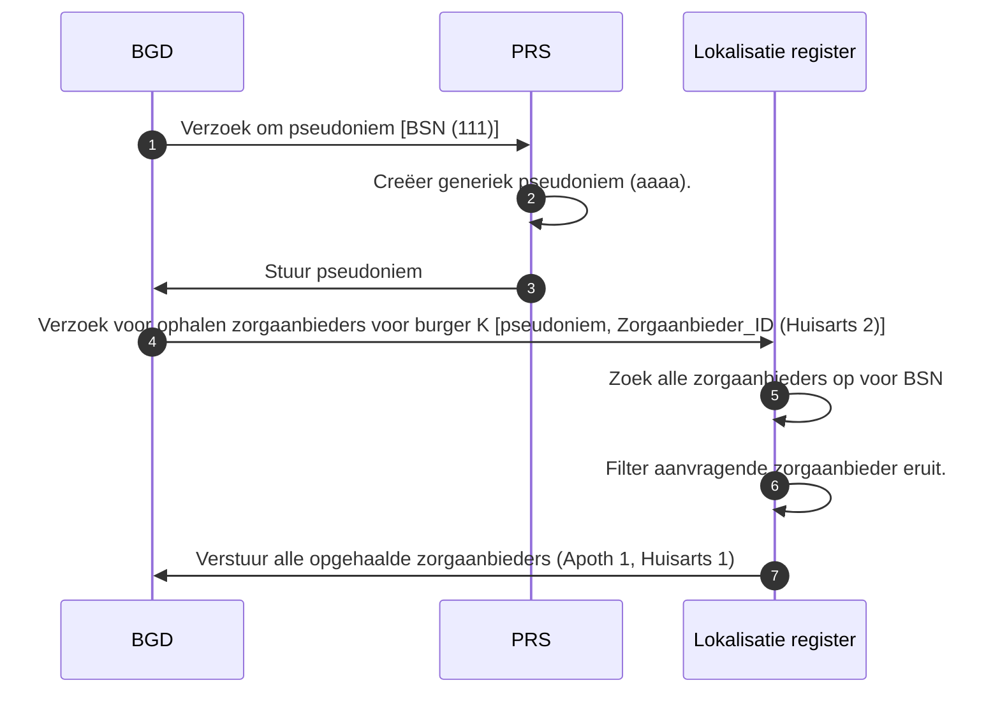

### Oplossingsrichting 3: Gegevens uitwisseling op basis van één pseudoniem per niet BSN gerechtigde partij. 

#### Omschrijving

De arts is BSN gerechtigd in deze casus maar de lokalisatieregister leverancier
niet. Hierdoor kent het lokalisatieregister alleen pseudoniemen. Deze
pseudoniemen zijn per burger per zorgdienst uniek.

#### Fictief voorbeeld 1a Zorgaanbieder registreert gegevens in lokalisatie dienst

Burger K meldt zicht aan bij een nieuwe huisarts. De huisarts registreert deze
burger in zijn eigen systeem (BGP) en stuurt deze gegevens door naar het
lokalisatieregister.

Lokalisatieregister

| Pseudoniem | Zorgaanbieder |
| ---------- | ------------- |
| A4         | Apoth 1       |
| A4         | Huisarts 1    |
| B3         | Apoth 3       |
| B3         | Huisarts 1    |

Centraal koppelregister

| BSN  | Zorgdienst | Pseudoniem |
| ---- | ---------- | ---------- |
| 1111 | PGO 1      | A1         |
| 1111 | PGO 2      | A2         |
| 1111 | Toestem.   | A3         |
| 1111 | Lokali     | A4         |

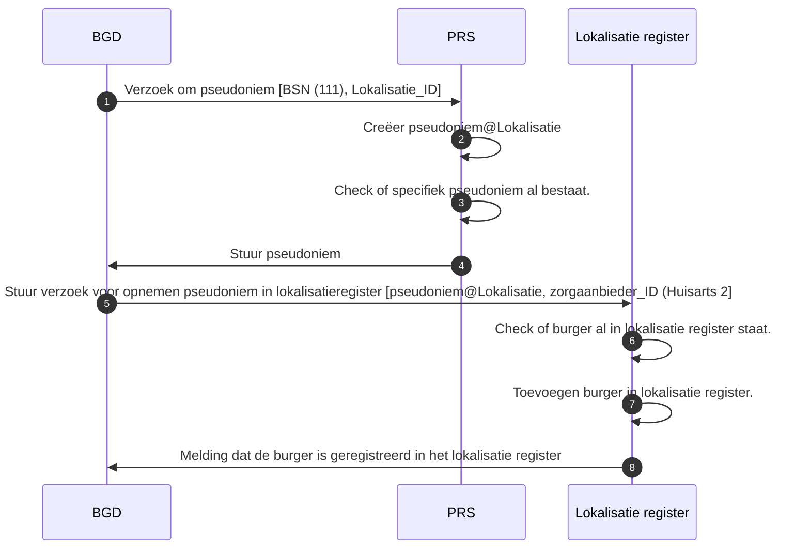


#### Fictief voorbeeld 1b Zorgaanbieder wil zien waar burger allemaal zorg afneemt

De nieuwe huisarts van burger K wil graag zien waar burger K in het verleden
zorg af heeft genomen, ofwel de zorggeschiedenis van burger K. 


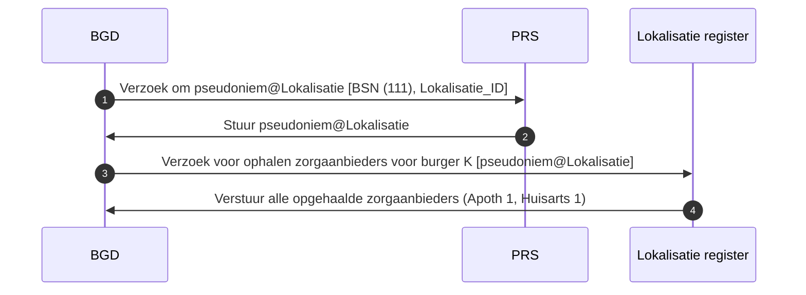

### Oplossingsrichting 4: Gegevens uitwisseling op basis van tokens die een beperkte levensduur hebben.


#### Fictief voorbeeld 1a Zorgaanbieder registreert gegevens in lokalisatie dienst

Burger K meldt zicht aan bij een nieuwe huisarts. De huisarts registreert deze
burger in zijn eigen systeem (BGP) en stuurt deze gegevens door naar het
lokalisatieregister.

Lokalisatieregister


| Pseudoniem | Zorgaanbieder |
| ---------- | ------------- |
| A4         | Apoth 1       |
| A4         | Huisarts 1    |
| B3         | Apoth 3       |
| B3         | Huisarts 1    |

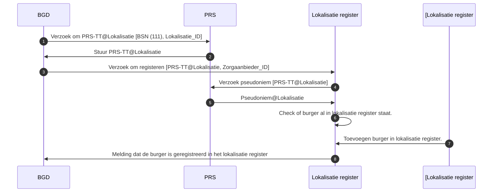

#### Fictief voorbeeld 1b Zorgaanbieder wil zien waar burger allemaal zorg afneemt

De nieuwe huisarts van burger K wil graag zien waar burger K in het verleden
zorg af heeft genomen, ofwel de zorggeschiedenis van burger K.

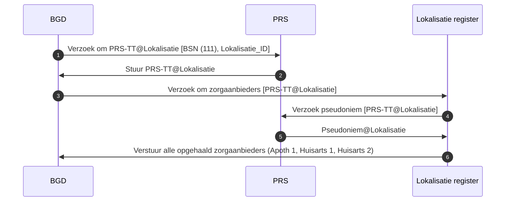

## Casussen voor migratie

Migratie speelt bij het gebruik van pseudoniemen. In dit geval kan het nodig
zijn om de een deel van het pseudoniemen te moeten rouleren. Dit kan bijvoorbeeld
doordat dit wenselijk is vanuit voorzorg (bij nieuwe technologische
ontwikkelingen) of wanneer er sprake is van een datalek bij een of meerdere
diensten.

Dit hoofdstuk beschrijft de uitdagingen en de bijbehorende oplossingen per
oplossingsrichting.

### Oplossingsrichting 1: Meer diensten BSN gerechtigd maken

Indien alle diensten het BSN gebruiken hoeft er geen migratie plaats te vinden.
Er is immers geen pseudoniem wat gerouleerd kan worden.

### Oplossingsrichting 2: Gegevens uitwisseling op basis van één pseudoniem.

In het geval van een zorgbreed pseudoniem kan het nodig zijn dat dit moet worden
omgezet in een nieuw pseudoniem. Om dit mogelijk te maken gaat dit deel er
vanuit dat een pseudoniem versie-informatie bevat.

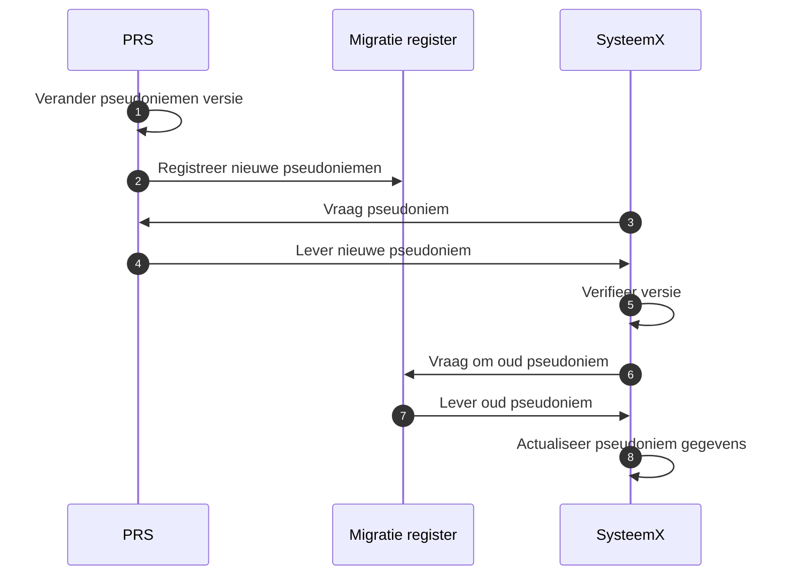

### Oplossingsrichting 3: Gegevens uitwisseling op basis van een uniek pseudoniem per niet BSN gerechtigde dienst

Bij uitwisseling van gegevens op basis van een pseudoniem per dienst is er een
migratie register nodig. Dit kan geraadpleegd worden voor het verkrijgen van een
oud pseudoniem op basis van een nieuwer pseudoniem.


### Oplossingsrichting 4: Gegevens uitwisseling op basis van tokens die een beperkte levensduur hebben.

Bij migratie van een systeem wat binnen het token model werkt, heeft de PRS zelf
een rol in de migratie. In dit geval zal deze, als uitgever van pseudoniemen,
een koppeling kunnen bijhouden van de oude naar de nieuwe "basis" pseudoniemen.

```mermaid
sequenceDiagram
autonumber

PRS->>PRS: Verander pseudoniemen versie
SysteemX->>PRS: Vraag pseudoniem (BSN/RID) met versie X
PRS->>PRS: Maak en registreer nieuw basis pseudoniem
PRS->>SysteemX: Lever oud & nieuw pseudoniem
SysteemX->>SysteemX: Verifieer versie
SysteemX->>SysteemX: Actualiseer pseudoniem gegevens


