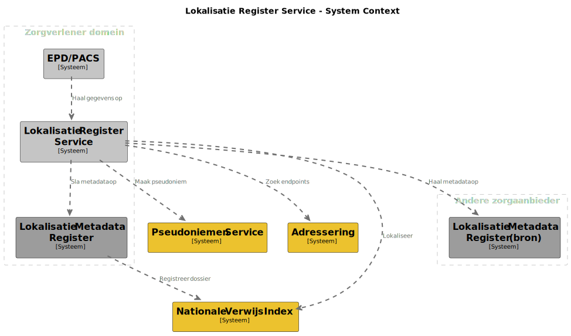
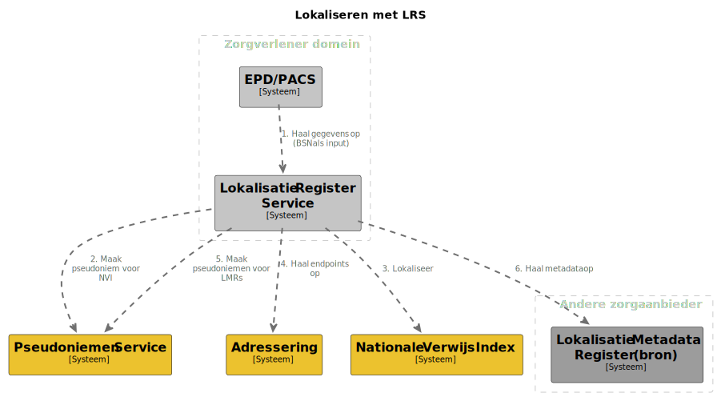
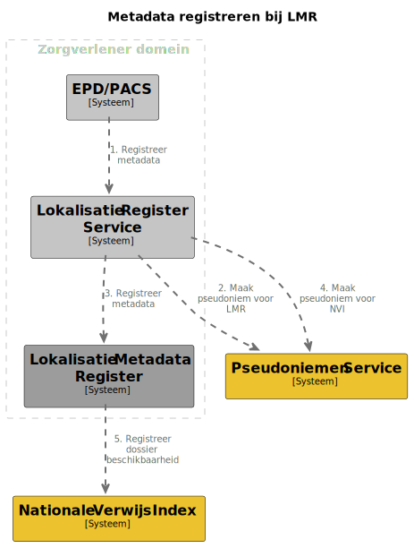

# Lokalisatie Metadataregister

## Achtergrond

Het Lokalisatie Metadataregister (LMR) heeft als doel informatieuitwisseling
tussen zorginstellingen te bevorderen. De eerste grote use-case hiervoor is het
uitwisselen van radiologische beelden. Dit document richt zich daarom primair
daarop. De uiteindelijke oplossing dient echter ook ingezet te (kunnen) worden
voor (alle) andere zorginformatie binnen (alle) andere zorgdomeinen.

De metadata is onderdeel van de informatiestandaard die geldt voor het
uitwisselen van een bepaalde soort zorginformatie. Bij de
[NEN-7519](https://www.nen.nl/nen-7519-2023-ontw-nl-316403) wordt op het moment
van schrijven gewerkt aan een informatiemodel voor lokalisatie. Dit model
beschrijft de (meta)data die beschikbaar is bij een lokalisatie vraag. Hierin is
vastgelegd dat er een vaste set van verplichte velden is die voor elke
uitwisseling geld. Daarnaast is er een set aan velden die afhankelijk van de
zorgspecifieke uitwisseling ingezet kan worden.

De [informatiestandaard voor
beelduitwisseling](https://informatiestandaarden.nictiz.nl/wiki/Bbs:V1_alpha.2_Ontwerp_Beeldbeschikbaarheid)
is een belangrijk bron van eisen waar de geschetste oplossing in dit document
invulling aan geeft is gericht op beelduitwisseling. Beelduitwisseling is echter
niet de enige uitwisseling die uiteindelijk ondersteund zal worden worden met de
voorgestelde opzet.

De doelstelling van het LMR met betrekking tot beelduitwisseling is om
beelduitwisseling tussen verschillende zorgaanbieders te faciliteren om zo tot
volledige beeldbeschikbaarheid te komen. De Kwaliteitsstandaard
Beeldbeschikbaarheid stelt dat beschikbaarheid van eerdere onderzoeken (beelden
en verslagen), naast de meest actuele, relevant is in elk zorgproces waar
beelden een rol spelen. Om dit mogelijk te maken is het nodig dat radiologen
een, zorgaanbieder onafhankelijke, tijdlijn kunnen zien van eerdere onderzoeken.
Het LMR heeft als doel deze tijdlijn mogelijk te maken.

## Overlap met burger data

Een deel van de beschreven oplossing in dit document zou ook gebruikt kunnen
worden voor zorguitwisseling met burgers. De use-cases die ten grondslag liggen
aan het LMR verschillen echter op een aantal kern punten:

- Voor de zorg-zorg uitwisseling is er sprake van een specifiek zorgdomein
- Zorg-zorg vereist data minimalisatie

Voor de burger is duidelijkheid en eenvoud in gebrek een kern doel. Bij
zorg-zorg uitwisseling is het gewenst om de data die uitgewisseld wordt te
beperken tot enkel de data die nodig is voor behandeling. Bij een burger speelt
dit vraagstuk niet, en zij kan daarom al haar data ophalen. Ook is het voor een
burger handig om alles binnen te halen en later te filteren / in een tijdlijn te
plaatsen dan op voorhand een zorgspecifieke vraag aan het systeem te stellen.

Hoewel de beschreven oplossing in dit document gebruik maakt van generieke
functies die ook voor de burger relevant zijn is het door dit accent niet
een-op-een van toepassing voor de burger. Het kan wel zijn dat dat bij een
uiteindelijke implementatie de technische uitwerking grotendeels overeenkomt met
dat wat voor de burger beschikbaar is (bijvoorbeeld wanneer er een datastation
gebruikt wordt wat zowel metadata vragen kan beantwoorden als de volledige
dataset kan leveren).

## Relatie met de generieke functies

Het LMR is een specifieke bouwsteen binnen de generieke functie lokalisatie.
Lokalisatie beschrijft het proces waarbij burgers en behandelaren zorgdata
kunnen vinden zonder dat op voorhand duidelijk is waar deze data zich bevind.

In dit proces vervult het LMR de rol van een systeem om antwoorden te geven op
vragen vanuit behandelaren. De voorgestelde oplossing vereist de aanwezigheid
van een verwijsindex om de "waar" vraag te beantwoorden. Ook maakt het gebruik
van de generieke functie adressering.

## Relatie met datastation

Het LMR is zowel een concept als een implementatie. In de conceptuele
interpretatie betreft dit het systeem waar metadata zoekopdrachten (FHIR
queries) gesteld kunnen. Hierbij kan de implementatie zowel door een los
software-systeem gedaan worden (LMR als systeem) of als onderdeel van een
datastation / bron-systeem. Voor bevragende systemen (EPD/PACS, Lokalisatie
Register Service etc.) maakt het geen verschil welke implementatie gekozen
wordt.

Dit maakt het mogelijk voor zorgaanbieders om een, bij de bestaande
infrastructuur, passende oplossing te kiezen.

## Lokalisatie Register Service

De Lokalisatie Register Service (LRS) is, gelijk met het LMR, zowel een concept
als implementatie. Conceptueel vervult het alle taken die nodig zijn voor het
bevragen van de verschillende systemen waaronder de pseudoniemen service, NVI,
adressering en de LMRs.

Dit concept kan, indien gewenst, direct worden ingebouwd in software systemen
als een PACS of EPD. Om adoptie te vereenvoudigen is er ook een referentie
implementatie van het LRS. Deze software is bedoeld om, onder
verantwoordelijkheid van de zorgaanbieder, geïnstalleerd en gebruikt te worden
om PACS of EPD systemen een sterk vereenvoudigde API aan te bieden.

### Afkortingen en begrippen

| Begrip             | Betekenis                                                                                                        |
|--------------------|------------------------------------------------------------------------------------------------------------------|
| Pseudoniem         | Een unieke ID voor een persoon binnen een specifieke dienst                           |
| Generieke functies | De generieke functies zijn (nieuwe) diensten ter ondersteuning van elektronische gegevensuitwisseling in de zorg |
| Lokalisatie        | De generieke functie die kan beantwoorden welke zorgaanbieder welke data heeft van welke persoon                 |
| Adressering        | De generieke functie die kan beantwoorden op welke endpoints de daadwerkelijke data opvraagbaar is               |
| EPD                | Elektronisch Patiëntendossier                                                                                    |
| PACS               | Picture Archiving and Communications System                                                                      |
| VNA                | Vendor Neutral Archive                                                                                           |

### Uitgangspunten

Het doel is om een standaard te bieden die informatie uitwisseling in de zorg
bevorderd. Om gebruik te stimuleren is er rekening gehouden met verschillende
implementatie en uitrol mogelijkheden. Het is mogelijk voor partijen om, indien
deze de capaciteit ervoor hebben, een eigen implementatie te maken of, indien
deze capaciteit niet beschikbaar is, van een standaard oplossing gebruik te
maken. Deze kan dan direct aansluiten op en gebruik maken van bestaande
applicaties en infrastructuur.

De verschillende uitrol scenario's zijn mogelijk door het gefedereerde karakter
van de oplossing. Gelijkend aan het WWW kan er daardoor flexibel omgegaan worden
met zowel technieken als uitrol.

### Doelgroep/ eindgebruikers

De primaire doelgroep bestaat uit zorgverleners binnen instellingen voor de medisch-specialistische zorg (MSZ) in Nederland bij:

- universitair medische centra
- ziekenhuizen
- radiotherapeutische centra
- bevolkingsonderzoek (RIVM)
- categorale ziekenhuizen
- klinische revalidatiecentra
- centra voor niet-klinische revalidatie
- zelfstandige behandelcentra

### Zorgprocessen

Het raadplegen van de tijdlijn van radiologische onderzoeken en de bijbehorende
beelden en verslagen kan deel uitmaken van de volgende zorgprocessen, zoals
beschreven in de Kwaliteitsstandaard Beeldbeschikbaarheid:

- radiologisch onderzoek
- reguliere verwijzing
- spoedverwijzing
- multidisciplinair overleg (MDO)
- parallelle of gedeelde behandeling

### Use-cases

#### Opvragen historische data

- In 2018 valt patiënt Y van zijn fiets en gaat naar de SEH.
- SEH-arts A laat een foto van de borst maken in ziekenhuis A. Patiënt Y blijkt
  een aantal gekneusde ribben te hebben.
- In 2020 wordt patiënt Y door zijn huisarts verwezen naar ziekenhuis B, omdat
  hij aanhoudende hoestklachten heeft.
- Longarts B laat een foto van de longen maken.
- Radioloog B, die de beelden beoordeelt, ziet een wit vlekje op de long. Dit
  zou een tumor kunnen zijn maar ook een litteken. Eerder onderzoek kan meer
  uitsluitsel geven.
- Radioloog B vraagt aan patiënt Y of er in het verleden beelden zijn gemaakt.
  De patiënt geeft aan dat dit het geval is maar niet meer te weten waar en
  wanneer dit gebeurd is. Radioloog B raadpleegt de "tijdlijn radiologische
  onderzoeken” van patiënt Y. Hiervoor is enkel de identificatie (BSN) van
  patiënt Y nodig. In de tijdlijn is te zien dat ziekenhuis A een borstfoto uit
  2018 heeft.
- Radioloog B haalt de beelden en verslagen uit ziekenhuis A op en bekijkt en
  beoordeelt deze. Op basis daarvan rapporteert hij aan de longarts dat het
  witte vlekje hoogstwaarschijnlijk een litteken is.

#### Directe uitwisseling

Voor specifieke situaties is het gewenst dat het systeem in de toekomst
notificaties kan versturen aan een zorgverlener die zich op (een bepaalde soort)
notificaties "abonneert". Dit is op het moment van schrijven nog niet uitgewerkt
in de informatiestandaard. Deze sectie zal aangevuld worden zodra de
informatiestandaard dit beschrijft.

### Diensten

Om de use-cases in te vullen kan de oplossing in meerdere diensten worden opgedeeld:

- **Bevraging**: het opvragen van data met behulp van een tijdlijn
- **Registratie**: het registreren van nieuwe of bijgewerkte zorgdata
- **Notificatie**: het versturen en ontvangen van een bericht naar een of
  meerdere systemen na registratie

Bevraging bestaat uit het ophalen van de gegevens van voorgaande onderzoeken
(beelden en/of verslagen) voor een specifieke patiënt. Registratie is het proces
waarbij een bronsysteem (meta)data aanlevert ten behoeve van het later op kunnen
bouwen van een tijdlijn. Notificatie zorgt voor het snel actualiseren van
systemen onderling bij nieuwe / bijgewerkte registraties.

### Proces

Om een complete tijdlijn op te kunnen leveren zal het bevragingspunt voor deze
tijdlijn metadata beschikbaar moeten hebben van eerdere onderzoeken. Om dit te
bereiken zal een bronsysteem (doorgaans een EPD, maar bij beelden een PACS, PACS
II, Enterprise PACS of VNA) dat een verslag en/of beeld beschikbaar wil (en kan
en mag) stellen, deze bekend moeten maken aan een register dat bevraagbaar is
door het bevragingspunt. Dit doet het bronsysteem door metadata van het verslag
en/of beeld naar het register te sturen. Dit is een geautomatiseerd proces.

## Functionals

### Tijdlijn integratie

De tijdlijn gebruikt de bevragingsdiensten binnen het LMR concept (dit kunnen er
meerdere zijn indien meerdere partijen zorgdata van een patient hebben) om te
komen tot een overkoepelend beeld over meerdere zorgaanbieders. 

De visuele tijdlijn dient geïntegreerd te worden met bestaande
zorginformatiesystemen (PACS, EPD etc.). Deze tijdlijn is te openen via een
patiënt. Op basis hiervan kan het zorginformatiesysteem de patiënt identificatie
gebruiken om, volgens de voorgeschreven wijze, de gegevens op te halen om de
tijdlijn te creëren.

### Automatisch bijwerken

Het metadata register dient automatisch actueel gehouden te worden. Om dit
mogelijk te maken zullen bestaande systemen (zoals PACS, EPD etc.) actief het
register moeten voeden met nieuwe of aangepaste records. De volgende typen
mutaties dienen hiervoor beschikbaar te zijn:

- toevoegen
- bijwerken (rectificaties)
- verwijderen

Daarnaast moet het mogelijk zijn om nieuwe beoordelingen te maken van bestaande
beelden. Een nieuwe beoordeling door de oorspronkelijke zorgverlener (de auteur)
- rectificatie geheten, levert een update aan de metadata op (UUID onderzoek
blijft behouden).

Een nieuwe beoordeling van bestaande beelden door een ander heet een
herbeoordeling. Dit levert een nieuw onderzoek op (nieuw UUID) inclusief een
nieuw verslag. De beelden kunnen gedupliceerd worden, met de nieuwe annotaties
erbij, of de oude kunnen behouden worden, waar de annotaties aan worden
toegevoegd. De annotaties verwerken valt onder verantwoordelijkheid van de
leveranciers en niet binnen het metadata register.

### Notificaties

Dit deel zal worden aangevuld wanneer de informatiestandaard is bijgwerkt met
informatie over de notificaties.

### Datamodel

De LMR(s) zijn per informatiestandaard/ uitwisseling. Dit betekend dat er voor
elke uitwisseling een "eigen" metadata register komt. Dit maakt het mogelijk om
per uitwisseling het datamodel af te stemmen op de behoeften van die
uitwisseling.

Daarmee bevat het LMR verschillende datasets die afhankelijk zijn van de
toepassing. Alle register-items hebben tenminste:

- ID (UUID)
- aanmaakdatum en tijd
- mutatiedatum en tijd (bij rectificatie)
- pseudoniem BSN (in de context van het LMR)
- type onderzoek / titel / korte omschrijving van het onderzoek
- datum en tijd onderzoek
- status onderzoek
- verantwoordelijk arts/uitvoerende voor/van het onderzoek
  - zorgverlener Id
  - zorgverlener naam
- URA-code zorgaanbieder
- naam zorgaanbieder volgens LRZa

Elk register kan additionele metadata hebben voor de uitwisseling. Hieronder een
voorbeeld van de lijst voor beelduitwisseling:

- WADO-RS (FHIR) URI (viewer)
- URI naar een end-point van het originele bestand

Voor andere tijdlijnen kan er andere additionele informatie in de metadata
worden opgenomen. Het is tevens mogelijk om binnen een informatiestandaard
meerder registers te hebben. Dit kan voorkomen wanneer er sub-domeinen zijn
waarbij elk sub-domein eigen metadata behoeften heeft.

Op het moment dat het gaat over het register als dienst voor meerdere partijen
dan dient het ook het type van van de gegevensuitwisseling te bevatten. Zie ook
[Bijlage | Dossierhoudende zorgaanbiedercategorieën - Mitz Afsprakenstelsel
1.0.2 - Confluence
(atlassian.net)](https://vzvz.atlassian.net/wiki/spaces/MA11/pages/127535906/Bijlage+Dossierhoudende+zorgaanbiedercategorie+n)

Bovenstaande informatie is nog niet definitief. In komende overleggen wordt
definitief bepaald wat de datasets worden die standaard vereist zijn en welke in
combinatie met de beoogde uitwisselingen worden toegepast.

## Afhankelijkheden

De volgende generieke functies worden buiten deze informatiestandaard
geadresseerd om de implementatie mogelijk te maken:

1.  Identificatie & authenticatie (van de zorgverlener, zorgaanbieder en de
    patiënt)
2.  Lokalisatie (vindbaarheid van patiëntgegevens) <- het LMR is onderdeel van
    'lokalisatie'
3.  Adressering (endpoints opzoeken)

Voor het raadplegen van de tijdlijn wordt toestemming gecontroleerd met behulp
van de diensten uit de generieke functie toestemmingen.

## Non-functionals

### Performance

> > **TBD**
> > Wens Radiologen: net zo snel voor interne als externe onderzoeken.

### Back filling

Het register dient het mogelijk te maken dat een zorgaanbieder de data
back-filled. Dit maakt het mogelijk om partijen aan te sluiten die een rijke
historie aan data hebben. Dit moet kunnen zonder dat dit de prestaties van het
systeem in zijn geheel laat afwijken van de gestelde performance doelen.

### Informatiestandaarden

De diensten binnen het project omvatten de registratie dienst, het
bevragingspunt en de LRS. Voor aansluiting bij het Nederlandse zorgveld dienen
deze diensten één of meerdere van de gangbare informatiestandaarden te
ondersteunen.

[FHIR](http://hl7.org/fhir/) is het primaire protocol voor implementatie. FHIR
is een standaard die binnen de Nederlandse zorg de voorkeur heeft in
verschillende afsprakenstelsels (o.a.
[IZA](https://www.rijksoverheid.nl/onderwerpen/kwaliteit-van-de-zorg/integraal-zorgakkoord),
[MedMij](https://medmij.nl/),
[AORTA-on-FHIR](https://www.vzvz.nl/initiatieven/aorta-fhir), etc.).

Naast FHIR zijn de onderstaande protocollen mogelijk gewenst voor een deel van
de interacties:

- IHE XDS
- IHE MHDS
- DICOM

## Oplossingen

Voor de LMR opzet zijn verschillende opties overwogen. Hierbij zijn er twee
primaire oplosrichtingen overwogen: gecentraliseerd en gefedereerd. In de
gecentraliseerde opzet is er één register (per zorgdomein of in het algemeen)
waar alle zorgaanbieders de metadata registreren. Met oog op privacy (data bij
de bron) en aansluiting bij de onderdelen van de doelarchitectuur is gekozen
voor een opzet voor het gefedereerde model.

### Gefedereerd register

Het onderstaande diagram laat zien hoe de samenhang van de systemen is opzet.

Deze opzet kenmerkt zich door het gebruik van een hoofd index (Nationale Verwijs
Index) die een minimale dataset registreert.

- Pseudoniem
- Detail register
- Type data (radiologisch etc.)

Vervolgens zijn er één of meerdere detail registers die de data bevatten voor de
tijdlijn. Deze registers bevatten:

- Pseudoniem
- Benodigde metadata voor de tijdlijn

De hoofdindex is voldoende om te weten waar de data is. Voor het opbouwen van
een tijdlijn worden de volgende stappen gevolgd:

1. Zoek via de NVI de zorgaanbieders voor het type data en het pseudoniem
2. Haal (parallel) de metadata op bij elke detail index (LMR)
3. De zorgtoepassing (of LRS) voegt de data samen tot een tijdlijn

De detail indexen kunnen per zorgaanbieder ingericht worden. Ook is het
mogelijk, voor partijen die dit niet zelf kunnen, om deze als dienst aan te
bieden.

#### Bevragen

Een applicatie een query sturen naar het centrale hoofd (verwijs) index (NVI).
Die geeft aan waar de specifieke registers te vinden zijn. De applicatie stelt
vervolgens (parallel) de vraag aan deze registers en combineert de antwoorden.

Het onderstaande diagram geeft een overzicht van de relaties voor bevraging van
de tijdlijn. Hierin zijn zowel de LRS dienst als het LMR als dienst opgenomen
(bevragingspunt).

##### Registratie

Het LMR, indien gebruikt, dient bij het bijwerken van dossiers geactualiseerd te
worden. De metadata registratie verloopt volgens de onderstaande diagram.

In het diagram wordt de LRS gebruikt voor registratie. Het is mogelijk voor
leveranciers van zorgsystemen om deze functionaliteit direct in te bouwen. In
dat geval is er geen los LRS nodig.

## Onderdelen van de oplossing

Deze sectie geeft een meer gedetailleerde toelichten op de onderdelen van de oplossing.

### Bevragingspunt

Het bevragingspunt is het endpoint wat (meta)data kan leveren voor een vraag
over een patiënt. Voor de lokalisatie is het belangrijk dat dit endpoint snel
kan antwoorden bij vragen. Het kan een dienst zijn die specifiek met dit doel
opgezet is. Ook kan het een endpoint zijn wat tevens gebruikt kan worden voor
het ophalen van de patiënt data zelf (wanneer dit een onderdeel is van het
datastation / bron-systeem van de zorgaanbieder).

### Lokatie register service

De uiteindelijke tijdlijn die bij een arts beschikbaar gesteld wordt zal via
meerdere stappen worden samengesteld. De logica hiervoor is het Lokatie Register
Service concep.t Als concept kan de LRS direct geïmplementeerd worden bij
bestaande zorgsystemen (zoals een PACS).

Daarnaast kan deze logica voor het verzamelen, inclusief foutafhandeling etc.,
worden gebundeld in een dienst. Deze dienst biedt vervolgens een vereenvoudigde
API aan waarmee het samenstellen van de tijdlijn minder implementatie druk bij
een zorgsysteem legt.

Binnen het project wordt er een referentie implementatie geleverd van deze
LRS. Tevens, kan indien dit juridisch mogelijk is, overwogen worden
om deze applicatie als dienst beschikbaar te maken.

#### IHE XDS

Om applicaties te ondersteunen die (nog) geen gebruik kunnen maken van de FHIR
opzet heeft de LRS een mogelijkheid om als XDS[^xds] Document Registry te
werken. Deze mogelijkheid is gericht op het ondersteunen van
beeldbeschikbaarheid volgens de door Nictiz opgestelde
beeldbeschikbaarheid[^beeldbeschikbaarheid] informatiestandaard.

Hierbij gaat het enkel om de mogelijkheid voor applicaties om data te
registreren. Het opzoeken van gegevens via XDS wordt **niet** ondersteund via de
LRS.

##### Registratie

Bij registratie via de XDS API zal de LRS een geconfigureerde LMR vullen. Enkel
de velden zoals beschreven in de implementatierichtlijn voor
beeldbeschikbaarheid[^beeldbeschikbaarheid] worden verwerkt.

> Openstaande vragen:
> - voor de omzetting naar OID zouden we voorbeelden willen van huidig XDS
>   gebruik. Zijn hier vanuit de XDS specialisten eventueel gedachten bij over
>   hoe dit zou kunnen werken?

[^xds]: https://profiles.ihe.net/ITI/TF/Volume1/ch-10.html
[^beeldbeschikbaarheid]: https://informatiestandaarden.nictiz.nl/wiki/Bbs:V1_Alpha2_IG#Document_Sharing_IHE_Profiles

### Pseudoniemen

Deze worden gebruikt om het gebruik van BSN te minimaliseren. Verdere
toelichting is te vinden op TBD.

### Adressering

De adressering is een generieke functie die het mogelijk maakt om op endpoints
van zorgaanbieders te vinden.

### Verwijs index

De verwijs index wordt gebruikt om bij lokalisatie te zoeken naar zorgaanbieders
die data hebben over een specifieke patiënt.

## Notified-pull v.s. pull voor bijwerken

De bovenstaande schemas zijn gebaseerd op een notified-pull[^notified-pull]
model. Dit houd in dat bijwerken plaatsvindt vanuit de bron. Deze verstuurt bij
elke mutatie een bericht naar de beoogde ontvanger.

Het is technisch ook mogelijk om dit om te draaien. Notified pull heeft als
voordeel dat er minder resources nodig zijn. Enkel wanneer er een mutatie is
hoeft het doel platform een signaal te ontvangen. Bij een pull model zal er
periodiek een aanvraag gedaan moeten worden.

De consequenties van het notified-pull model zijn dat de verzendende systemen
een bericht mogelijk meerdere keren dienen te versturen. Dit speelt wanneer de
ontvangende partij een foutcode geeft.

Ontvangende partijen moeten correct omgaan met het meerdere keren ontvangen van
hetzelfde bericht.

[^notified-pull]: Dit betreft een oplossing waarbij er push plaatsvind met een
    minimaal bericht (bijvoorbeeld enkel het ID van het betreffende record).
    Hierna volgt, indien het ontvangende systeem dit nodig acht, een pull om de
    data bij te werken.

## Bronnen

- Opdrachtomschrijving iRealisatie (20231229 Opdracht voor realisatie van het metadataregisterRA)
- Beeldbeschikbaarheid - guide to XDS and a proposal for a Landelijk Index in the Netherlands
- https://informatiestandaarden.nictiz.nl/wiki/Bbs:V1_alpha.2_Ontwerp_Beeldbeschikbaarheid
- https://informatiestandaarden.nictiz.nl/wiki/Bbs:V1_Alpha2_IG
- https://www.nen.nl/nen-7519-2023-ontw-nl-316403
- https://nictiz.github.io/api-strategie-docs/v1.1.0/
- https://decor.nictiz.nl/pub/bbs/bbs-html-20240208T092809/scenarios.html
- https://www.nen.nl/nen-7519-2023-ontw-nl-316403