# Authenticatie en autorisatie

## Inleiding

Voor de generieke functie lokalisatie worden de NVI en de LMR's gevraagd
gegevens te leveren over een burger. Voordat deze systemen kunnen overgaan tot
het delen van deze gegevens dient het duidelijk te zijn dat dit een legitiem
verzoek betreft. Dit document geeft aan hoe systemen als de NVI en LMR dit
kunnen bepalen.

## Onderdelen

Een autorisatie wordt afgegeven op basis van de onderstaande kenmerken:

- de zorgverlener
- de zorgaanbieder
- het doel
- behandelrelatie

Het onderstaande schema geeft weer hoe de beslislogica er, op conceptueel niveau, uit ziet.

```mermaid
flowchart TD
	nood["Is er een noodsituatie?"]
	toestemming["Toestemming van de patient?"]
	deel1["✅ Deel gegevens"]
	deel2["✅ Deel gegevens"]
	deel3["✅ Deel gegevens"]
	stop1["🛑 Stop"]
	stop2["🛑 Stop"]
	stop3["🛑 Stop"]
	doel["Gegevens nodig voor doel?"]
	ontvanger["Is de ontvanger betrokken bij de behandeling?"]

	classDef einde fill:#fff,stroke-width:1px
	class stop1,stop2,stop3 einde;
	class deel1,deel2,deel3 einde;
	
	nood -->|Nee| toestemming
	nood -->|Ja| deel1

	toestemming -->|Nee| stop1
	toestemming -->|Ja| deel2
	toestemming -->|Geen keuze| doel

	doel -->|Ja| ontvanger
	doel -->|Nee| stop2

	ontvanger -->|Ja| deel3
	ontvanger -->|Nee| stop3
```

## Betrokken bronnen

Voor het doorlopen van de beslisboom zijn er verschillen bronnen nodig. Deze bronnen zijn:

- Dezi - kan de ontvanger vaststellen
- XIS - legt de behandelrelatie, het doel en het bestaan van een eventuele noodsituatie vast
- Mitz - heeft toestemmingsregistratie
- ... - doel?

## Validatie

Op basis van de gegevens uit de beslisboom heeft een systeem (NVI/LMR) de
mogelijkheid nodig om te verifiëren dat aan de voorwaarden voor het delen van
gegevens voldaan is.

Dit houdt in dat een aanvraag voor gegevens vergezeld dient te gaan met de
antwoorden, en onderbouwing, uit de beslisboom. Hierbij is het belangrijk dat de gegevens vertrouwd kunnen worden. Om dit mogelijk te maken kan elke bron haar gegevens op een dusdanige manier aanleveren dat dit geautomatiseerd geverifieerd kan worden.

Dit resulteert in een volgende data model.

> Weglaten: een expliciete toestemming dient

Hierbij moet het systeem in staat zijn te registreren wat de grond voor levering van gegevens was. Dit kan, in het geval van een mogelijk probleem, gebruikt worden om te beoordelen of de gegevens op legitieme grond geleverd zijn.

OTV als basis
Autorisatie logica op basis van vastgelegde rollen en gegevens

	1.	Een controle uit te voeren op deelnemer aan de uitwisseling/autorisatie afspraken. Als bijvoorbeeld de deelnemer een fysio therapeut is die informatie voor beeldbeschikbaarheid op wil vragen maar geen onderdeel is van de autorisatie-afspraken dan stopt het proces met een melding. 
	2.	Een controle hoe de autorisatie-afspraken zijn opgesteld. Als die op het niveau van aanbieder en/of rolcode is dan volstaat de zorgidentiteit die al zicht geeft op de combinatie van ura en rolcode omdat dat attributen zijn die ook in de zorgidentiteit zijn opgenomen. 

Wallet

Behandelrelatie?

	Willen we zeker weten dat de zorgverlener/arts beschikt over de juiste autorisaties dan moet ook hiervoor een token/VC beschikbaar komen. Die moet eigenlijk door het EPD van de instelling worden geleverd, dus we kunnen daarbij vragen om die te ‘uploaden’ in onze omgeving. Ook de VC voor Autorisatie moet worden opgenomen in de wallet die wij gebruiken (of die de zorgaanbieder/zorgverlener zelf gebruikt). 

	Vanuit Mitz komt er een permit of deny terug in de vorm van een token of VC. Ook deze komt terecht in de wallet die hierboven al is benoemd. 

## Uitdagingen

## Technische uitdagingen en randgevallen

