# Authenticatie en autorisatie

## Inleiding

Voor de generieke functie lokalisatie worden de NVI en de LMR's gevraagd
gegevens te leveren over een burger. Voordat deze systemen kunnen overgaan tot
het delen van deze gegevens dient het duidelijk te zijn dat dit een legitiem
verzoek betreft. Dit document geeft aan hoe systemen als de NVI en LMR dit
kunnen bepalen.

## Onderdelen

Een autorisatie wordt afgegeven op basis van de onderstaande kenmerken:

- de zorgverlener
- de zorgaanbieder
- het doel
- behandelrelatie

Het onderstaande schema geeft weer hoe de beslislogica er, op conceptueel niveau, uit ziet.

```mermaid
flowchart TD
	nood["Is er een noodsituatie?"]
	toestemming["Toestemming van de patient?"]
	deel1["✅ Deel gegevens"]
	deel2["✅ Deel gegevens"]
	deel3["✅ Deel gegevens"]
	stop1["🛑 Stop"]
	stop2["🛑 Stop"]
	stop3["🛑 Stop"]
	doel["Gegevens nodig voor doel?"]
	ontvanger["Is de ontvanger betrokken bij de behandeling?"]

	classDef einde fill:#fff,stroke-width:1px
	class stop1,stop2,stop3 einde;
	class deel1,deel2,deel3 einde;
	
	nood -->|Nee| toestemming
	nood -->|Ja| deel1

	toestemming -->|Nee| stop1
	toestemming -->|Ja| deel2
	toestemming -->|Geen keuze| doel

	doel -->|Ja| ontvanger
	doel -->|Nee| stop2

	ontvanger -->|Ja| deel3
	ontvanger -->|Nee| stop3
```

## Betrokken bronnen

Voor het doorlopen van de beslisboom zijn er verschillen bronnen nodig. Deze bronnen zijn:

- Dezi - kan de ontvanger vaststellen
- XIS - legt de behandelrelatie, het doel en het bestaan van een eventuele noodsituatie vast
- Mitz - heeft toestemmingsregistratie
- ... - doel?

## Het toegangsbewijs

Op basis van de gegevens uit de beslisboom heeft een systeem (NVI/LMR) de
mogelijkheid nodig om te verifiëren dat aan de voorwaarden voor het delen van
gegevens voldaan is.

Dit houdt in dat een aanvraag voor gegevens vergezeld dient te gaan met de
antwoorden, en onderbouwing, uit de beslisboom. Het totaal van deze gegevens is
het toegangsbewijs. Hieronder volgt een grafische weergave van de velden in dit
toegangsbewijs:

In bovenstaande diagram zijn bij het Toegangsbewijs drie primaire bronnen
betrokken:

- Dezi
- Mitz
- XIS

Het toegangsbewijs bevat per bron de gegevens die nodig zijn voor het bepalen
van de autorisatie. Een toegangsbewijs dient te allen tijde XIS en Dezi data te
bevatten. Mitz is optioneel voor het geval waarbij de toestemmingsgrond de
categorie "spoed" heeft.

## Registratie en logging

Bij het leveren van gegevens dient vastgelegd te worden wat de grond was waarop
toegang gegeven is. Dit maakt het mogelijk om, in het geval van (mogelijke)
problemen, aan te tonen dat de gegevens op legitieme grond geleverd zijn.

Hierbij is het mogelijk dat het mogelijk om in de logs vast te leggen welke
referentie ID's (zie [Het toegangsbewijs](#het-toegangsbewijs)) gebruikt zijn.
Een andere optie is het vastleggen van het gehele toegangsbewijs. Dit laatste
heeft als extra voordeel dat er bij de dienst die data levert een volledig beeld
is van de leveringsgrond. Dit voorkomt, in het geval van triage, afhankelijkheid
van andere systemen en partijen.

## Verificatie van toegang

Voor het doorlopen van de toegangsverificatie kan een systeem volstaan met de
volgende controles.

```mermaid
flowchart TD
	toestemming["Heeft Mitz toestemming gegeven?"]
	nood["Claimt het XIS een spoed situatie?"]
	deel1["✅ Deel gegevens"]
	deel2["✅ Deel gegevens"]

	classDef einde fill:#fff,stroke-width:1px
	class deel1,deel2,deel3 einde;

	toestemming -->|Nee| nood
	toestemming -->|Ja| deel1
	
	nood -->|Ja| deel2
```

> Vraag: moet de impliciete toestemming (verwijzing) worden meegenomen? Dit is voor lokalisatie niet relevant omdat er dan al bekend is welke partijen betrokken zijn.

Hierbij wordt er vanuit gegaan dat het XIS de inhoudelijke controle op
behandelrelatie en doel uitgevoerd heeft. Een XIS zou geen contact mogen opnemen
met een ander systeem als nog niet aan deze voorwaarde voldaan. Ook is in het
bovenstaande stroomschema alle negatieve takken weglaten. Dit is gedaan om
dezelfde reden. Een XIS zou, bijvoorbeeld bij een negatief antwoord vanuit Mitz,
geen vraag moeten sturen naar een NVI/LMR.

## Verificatie van toegangsbewijs

Uit de stappen voor [verificatie van toegang](#verificatie-van-toegang) blijkt
dat er twee claims zijn die minimaal vastgelegd dienen te worden. Deze claims
komen van twee partijen; de zorgaanbieder (XIS) en Mitz.

Deze claims dienen gevalideerd te kunnen worden. De claim vanuit het XIS kan
impliciet geverifieerd worden. Het XIS stelt de vraag voor informatie via een
beveiligde verbinding. Dit maakt dat er altijd vertrouwd kan worden dat deze
claim door het XIS is opgesteld.

De claim van Mitz kan niet impliciet geverifieerd worden. Hiervoor is expliciete
verificatie noodzakelijk. Om dit te doen kan er van cryptografische technieken
gebruik gemaakt worden waarmee bewezen kan worden dat de claim van Mitz
afkomstig is. 

## TODO

- Autorisatie vereist ook een grondslag op doel & type zorgaanbieder (fysio mag nooit X uitvragen)
- Vraag: moet er iets gebeuren met de rollen vanuit Dezi?
- Technische uitwerking

