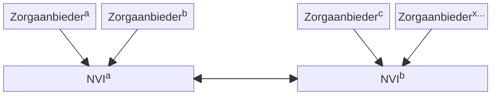
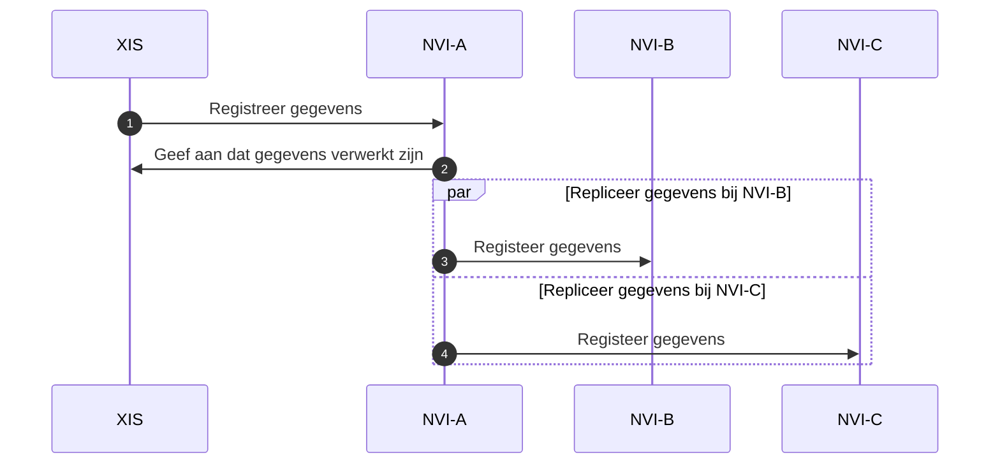
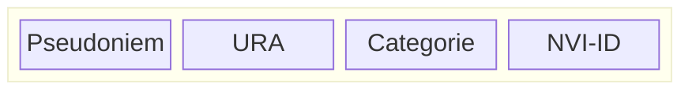

# Nationale Verwijs Index toewijzing per burger

## Inleiding

De Nationale Verwijs Index (NVI) is op verschillende wijzen in te richten. Dit
document beschrijft hoe de NVI opgezet kan worden als een decentraal systeem
waarbij de gegevens over een burger gerepliceerd worden tussen verschillende
aangesloten partijen.

Dit maakt het mogelijk voor een zorgaanbieder om een partij te kiezen om haar
aansluiting mee te verzorgen. De verschillende NVI-partijen zorgen onderling
voor de beschikbaarheid van de gegevens, ongeacht de NVI waarbij een zorgpartij
is aangesloten.

In het bovenstaande schema heeft elke zorgaanbieder een eigen partij gekozen
voor de NVI. Bij deze partij kunnen zij gegevens aanleveren en opvragen. De
NVI-systemen zorgen onderling voor uitwisseling zodat er, na uitwisseling, geen
afhankelijkheid is voor het lokaliseren.

Elk NVI-systeem kan in het replicatiemodel een eigen pseudoniem gebruiken.
Hiervoor is het nodig dat een pseudoniemen dienst beschikbaar is die
communicatie tussen niet BSN-gerechtigde diensten over een burger mogelijk
maakt. Een dergelijke dienst wordt op dit moment uitgewerkt.

De huidige versie van het document dient enkel als discussie stuk en geeft geen
definitief besluit.

## Opties voor replicatie

Dit hoofdstuk beschrijft verschillende opties voor replicatie van gegevens
tussen NVI-systemen.

### Conflict vrije volledige replicatie

Het is mogelijk om voor de zorgaanbieders de NVI-partijen zo te laten
samenwerken dat deze elk afzonderlijk als een centrale NVI lijken te werken. Dit
kan door alle data tussen de NVI-systemen te repliceren.

Elke NVI heeft in dit model de volledige dataset. Zodra een zorgaanbieder data
registreert, wordt dit (asynchroon) gerepliceerd naar de andere NVI-systemen.

In dit model kan elk NVI-systeem te allen tijde al haar data repliceren naar
andere NVI-systemen. Dit kan bijvoorbeeld door gebruik te maken van
[conflictvrije gerepliceerde data
types](https://en.wikipedia.org/wiki/Conflict-free_replicated_data_type). Op
deze manier ontstaat er geen afhankelijkheid een enkele partij. Ook kan een
zorgaanbieder op elke moment wisselen van NVI-systeem leverancier.

Voordelen van deze opzet zijn een hoge mate van betrouwbaarheid. Bij (tijdelijk)
uitval van een van de NVI-systemen zijn alle de gebruikers van dat systeem
getroffen. Deze kunnen eventueel (direct) overschakelen op een ander
NVI-systeem. Wanneer het getroffen systeem later weer beschikbaar komt, wordt
het via een van de andere NVI-systemen geactualiseerd.

Een nadeel is dat het de implementatie van het algoritme voor replicatie kennis
vereist bij de implementatie partij(en). Dit kan deels worden ondervangen door
een referentie implementatie en geautomatiseerde tests te leveren.

### Bak per NVI-partij

Replicatie tussen verschillende NVI-systemen kan uitgaan van een "eigenaar-NVI".
Voor elk NVI-record kan worden bijgehouden bij welke NVI deze afkomstig is. Dit
maakt het mogelijk deze records te delen tussen de verschillende NVI-systemen.

Een NVI-record ziet er dan als volgt uit:

Enkel de eigenaar-NVI mag in deze opzet een record verwijderen. Ook kan de
eigenaar-NVI worden aangewezen als de enige partij die haar records mag
repliceren naar andere NVI-systemen. Dit model maakt replicatie conceptueel en technisch
relatief eenvoudig.

Technische eenvoud is het grootste voordeel van deze replicatie vorm. 

Een nadeel is dat replicatie afhankelijk is van de beschikbaarheid van de
eigenaars. Het twee nadeel betreft de mogelijkheid voor een zorgaanbieder om van
partij te wisselen. In dit geval dienen alle records in de nieuwe NVI toegevoegd
te worden en uit oorspronkelijke NVI verwijderd te worden. Daarna levert dit ook
mutaties (via replicatie) op in de andere NVI-systemen.

## Uitdagingen bij NVI-replicatie

Ongeacht de gekozen optie spelen de onderstaande uitdaging bij het repliceren tussen verschillende NVI-partijen.

### Stelsel

Een gerepliceerd NVI vereist een stelsel waarin voorwaarden worden vastgelegd
waaraan NVI-partijen dienen te voldoen. Bij deze voorwaarden dient naast prestaties en beschikbaarheid vooral de replicatie eisen vastgelegd te worden.

### Verplichte deelname aan stelsel

Zorgpartijen moeten verplicht worden om hun data beschikbaar te stellen via het
stelsel.

### Eigenaarschap van data

In het replicatie model zal de data tussen verschillende NVI-partijen
gerepliceerd worden. Dit betekent dat hiervoor duidelijke kaders nodig zijn met
betrekking tot verantwoordelijkheden over de gegevens.

## Technische uitdagingen en randgevallen

Elke optie voor de NVI, of het nu decentraal of centraal is, heeft haar eigen
technische uitdagingen en randgevallen. De onderstaande punten zijn zaken waar
tijdens de verdere uitwerking van een optie rekening mee gehouden kan worden om
eventuele problemen zoveel mogelijk te voorkomen. 

### Replicatie monitoring

Het fundament onder de in dit document beschreven NVI vormen is replicatie. Hiermee ontstaan enkele technische uitdagingen die vanwege fundamentele eigenschappen die in de computerwetenschap bekend zijn. In dit document zijn verschillende vormen van replicatie voorgesteld die de complexiteit en problemen trachten te beperken.

Bij problemen in replicatie kan een onvolledig beeld ontstaan bij lokalisatie.
Daarom zal in productie gemonitord moeten worden of de replicatie goed werkt (en
blijft werken).

## Voordelen van een NVI-replicatie ten opzicht van een centrale NVI

Beschikbaarheid
Vrije keuze voor zorgaanbieders