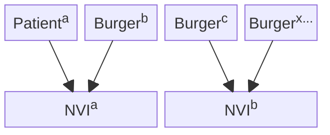
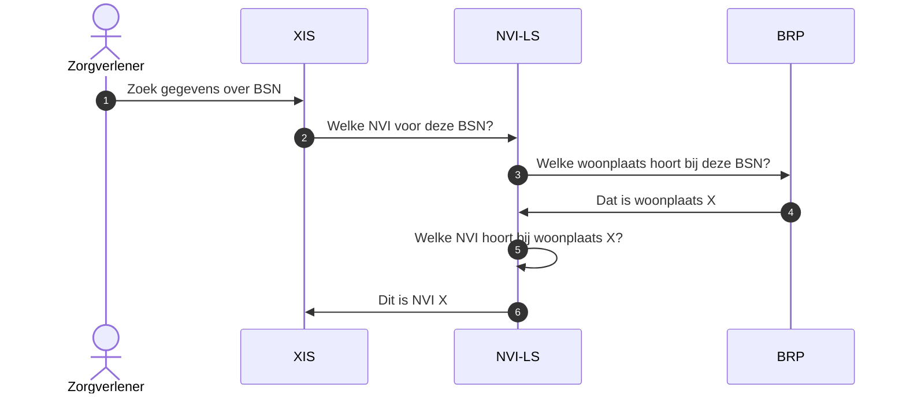
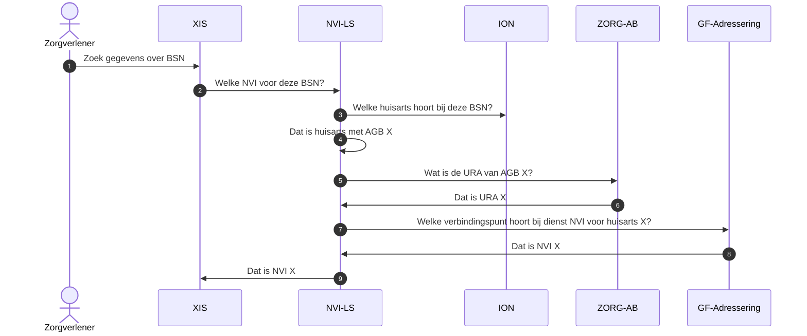
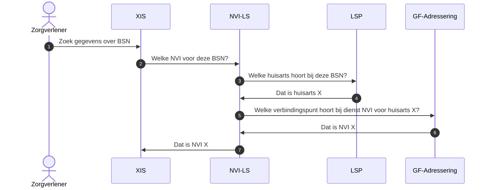
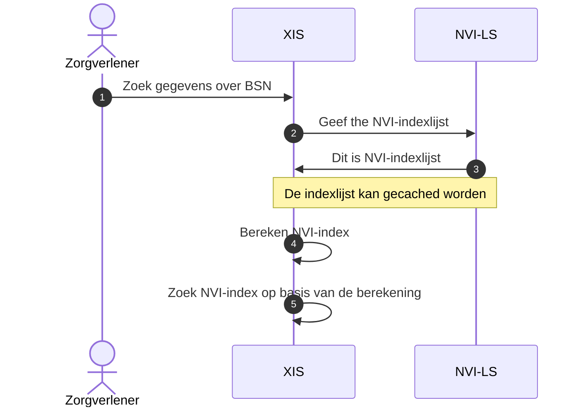

# Nationale Verwijs Index toewijzing per burger

## Inleiding

De Nationale Verwijs Index (NVI) is op verschillende wijzen in te richten. Dit
document beschrijft hoe de NVI opgezet kan worden als een decentraal systeem
waarbij de gegevens over een burger toegewezen worden aan een enkele partij.

In deze opzet heeft de NVI, die aangewezen is voor die burger, een index van
alle betrokken zorgorganisaties. Dit document werkt uit hoe deze toewijzing
eruit kan zien en welke voor- en nadelen dit model heeft. Dit document gaat
expliciet *niet* over een distributie model waarbij informatie over één burger
over meerdere NVI-partijen verdeeld is.

De huidige versie van het document dient enkel als discussie stuk en geeft geen
definitief besluit.

## Opties voor toewijzing

Dit hoofdstuk beschrijft verschillende opties voor toewijzing van een burger aan
een specifieke NVI.

### Regionaal

Bij de toewijzing van een NVI op basis van regio kan gebruik gemaakt worden van
de woonplaats van de burger. Deze woonplaats kan via de Basisregistratie
Personen (BRP) bepaald worden. De hieruit volgende NVI-lokaliseer taak kan
eventueel centraal belegd worden. Deze sectie gaat uit van een centrale
NVI-lokaliseringsservice (NVI-LS). Dit maakt deze taak expliciet. Het is wel
mogelijk, indien alle betrokken een mogelijkheid hebben om direct de BRP te
benaderen, ook dit deel decentraal te maken. 

Het onderstaande sequentie diagram laat zien hoe lokalisatie, tot en met het
bepalen van de aan de burger toegewezen NVI.

### Huisarts

De huisarts wordt binnen de Nederlandse zorg als spil gezien. Dit maakt het
logisch om een toewijzing van een NVI aan een burger plaats te laten vinden op
basis van diens huisarts. 

Een belangrijk voordeel van de NVI per huisarts is dat de huisarts BSN
gerechtigd is. Ook weet deze vanuit de spil functie de relatie met andere
partijen al. Dit maakt dat er geen extra gerelateerde privacy maatregelen nodig
zijn voor het opslaan van te indexeren gegevens. Maatregelen als een pseudoniem
ter vervanging van BSN zijn dan ook niet nodig.

Als laatste belangrijke voordeel is dat de huisarts NVI als functionaliteit
ingebouwd kan worden in bestaande huisartsinformatiesystemen. Hierdoor is er
geen aparte beheersorganisatie nodig voor een losse NVI.

Om een lokalisatie vraag aan een huisarts NVI te stellen moet bepaald kunnen
worden welke huisarts bij een specifiek BSN hoort. Hiervoor is een (conceptuele)
NVI-lokalisatieservice nodig. Deze kan op verschillende wijzen worden ingevuld.

#### ION 

De [ION-database](https://inschrijvingopnaam.nl/ion-database) maakt het
mogelijk om op basis van een BSN de AGB-code van een huisarts te vinden. Om dit
mogelijk te maken zal er een dienst moeten komen, of een uitbreiding van een
bestaande dienst, die het mogelijk maakt om de ION-database uit te lezen voor
dit doel. In deze sectie wordt deze dienst de NVI-lokalisatieservice (NVI-LS)
genoemd.

Na het verkrijgen van de AGB-code kan vervolgens, bijvoorbeeld via ZORG-AB, de
URA van de huisarts opgehaald worden. Met deze URA kan het verbindingspunt van
de toegewezen NVI via de adresseringsdienst worden opgehaald.

Het onderstaande diagram geeft een overzicht van de systemen en de communicatie
ertussen.

#### LSP

Het Landelijk Schakelpunt (LSP) bied een mogelijkheid een NVI toe te wijzen aan
een burger. Hier kan op basis van het BSN de vraag gesteld worden welke huisarts
op dit moment de toegewezen partij is.

> Check vraag: klopt dit of is dit "bewerkelijk"?

Onderstaande diagram geeft weer hoe de communicatie stroom er in dit geval kan
zien.

### Algoritmisch

Welke NVI voor een burger gebruikt wordt kan via een algoritme bepaald worden.
Hierbij zijn verschillende algoritmes denkbaar. Om dit concreet te maken volgt
nu een voorbeeld op basis van een wiskundige modulo operatie.

Er vanuit gaande dat er drie NVI-partijen zijn waar elke burger aan toegewezen
dient te worden kan er op basis van het BSN een toewijzing plaatsvinden. Dit kan
door het gebruikt van de modulo operator. In dit geval wordt het BSN als geheel
gezien. Vervolgens gedeeld door drie (het aantal NVI's in dit voorbeeld). De
rest waarde (0, 1 of 2) wijst vervolgens de NVI voor deze burger aan.

Bovenstaande is een simpel voorbeeld van een algoritmische toewijzing. In plaats
van modulo kunnen ook andere algoritmes gebruikt worden die een gelijk effect
geven.

Voor het bepalen van het technische adres (URI) van de NVI is een opzoeklijst
nodig van index naar adres. Deze lijst kan een lijst zijn die als
NVI-lokalisatieservice door een centrale partij wordt onderhouden.

Het onderstaande diagram geeft een overzicht van de stappen bij algoritmische
toewijzing.

## Uitdagingen bij NVI-toewijzing

Ongeacht de gekozen optie spelen de onderstaande uitdaging bij het toewijzen van
een burger aan een specifieke NVI-partij.

### Aansturing van NVI-partijen

Door het model van toewijzing zijn er meerdere partijen verantwoordelijk voor
het leveren van de NVI als dienst. Indien een van deze partijen haar taken niet
op het gewenste niveau uitvoert, ontstaat er voor de zorg in de bredere zin een
uitdaging. Voorbeelden van mogelijke problemen zijn een dienst die hoge latentie
geeft op aanvragen, een lage beschikbaarheid heeft (waardoor lokalisatie voor
die burgers mislukt) of een partij die haar beveiliging niet op orde heeft.

### Specifiek voor toewijzing op basis van huisarts

Bij de toewijzing op basis van huisarts speelt een uniek probleem. Niet elke
persoon in Nederland, die wel over een BSN beschikt, is ingeschreven bij een
huisarts.

## Technische uitdagingen en randgevallen

Elke optie voor de NVI, of het nu decentraal of centraal is, heeft haar eigen
technische uitdagingen en randgevallen. De onderstaande punten zijn zaken waar
tijdens de verdere uitwerking van een optie rekening mee gehouden kan worden om
eventuele problemen zoveel mogelijk te voorkomen. 

### Verplaatsing van toewijzing

Het kan om verschillende redenen nodig zijn een om een NVI-toewijzing voor een
specifieke burger aan te passen. In het geval van een regio toewijzing kan dit
optreden indien iemand verhuist. Bij een algoritmische toewijzing is dit nodig
bij een aanpassing in het aantal NVI-partijen.

In een dergelijk geval zullen alle gegevens van NVIa naar
NVIb verplaatst moeten worden. Hoewel dit een snelle transitie kan
zijn, zorgt dit tijdens de transitie periode voor een inconsistente toestand.

Een lokalisatie vraag gaat bijvoorbeeld al naar NVIB terwijl de
gegevens daar nog niet volledig zijn gerepliceerd. Dergelijke problemen zijn
technische tot op zeker hoogte te mitigeren door extra maatregelen in zowel de
NVI-implementatie als de NVI gebruikende software.

### Wijziging aantal NVI-partijen

Zowel bij uitbreiding als bij reductie van het aantal NVI-partijen kan dit
aanleiding geven om (grote) aantallen burgers een nieuwe toewijzing te geven
(verplaatsing van toewijzing).

## Voordelen van een NVI-toewijzing ten opzicht van een centrale NVI

Het opzetten van de NVI als decentraal systeem op basis van toewijzing van een
burger biedt een aantal voordelen. Een van deze voordelen is dat de
beschikbaarheid van het totale systeem niet afhankelijk is van één partij. Wel
is het zo dat dit tevens een uitdaging kan vormen.

Vanwege het ontwerp van de NVI, waarbij er met pseudoniemen gewerkt wordt, en
waarbij er enkel een categorie en zorgaanbieder ID (URA) verbonden zijn aan de
registratie, is het gevolg op privacy van een datalek bij een NVI beperkt. Toch
kan als voordeel van een decentrale NVI op basis van toewijzing vermeld worden
dat deze, in het geval van een lek, minder data zal lekken. Een nadeel is echter
wel dat het beveiligen en veilig houden van meerdere systemen bij meerdere
partijen lastiger is.

Als laatste argument voor een decentrale NVI zou schaalbaarheid genoemd kunnen
worden. De verwachte hoeveelheid data in de NVI is echter dermate gering dat op
moderne infrastructuur dit geen enkel belang vormt. Ook naar de toekomst toe zal
de capaciteit in rekenkracht, opslag en geheugen naar verwachting sneller
toenemen dan het aantal records in de NVI (bijvoorbeeld als gevolg van
bevolkingsgroei).