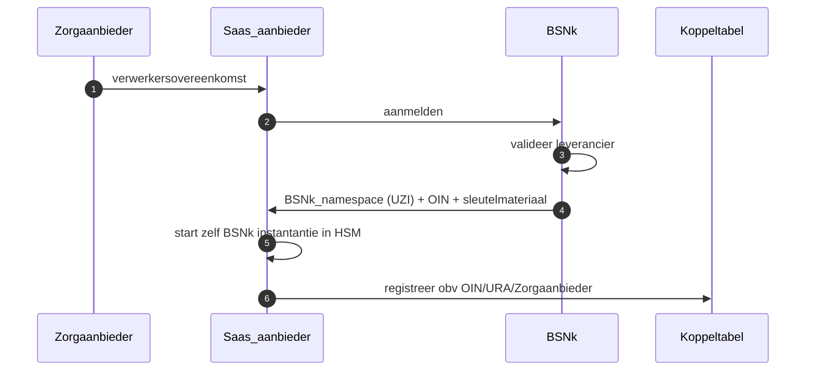
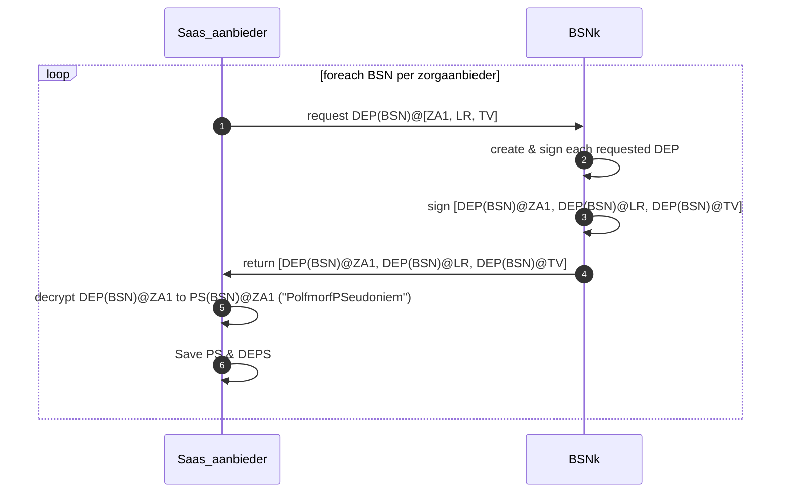
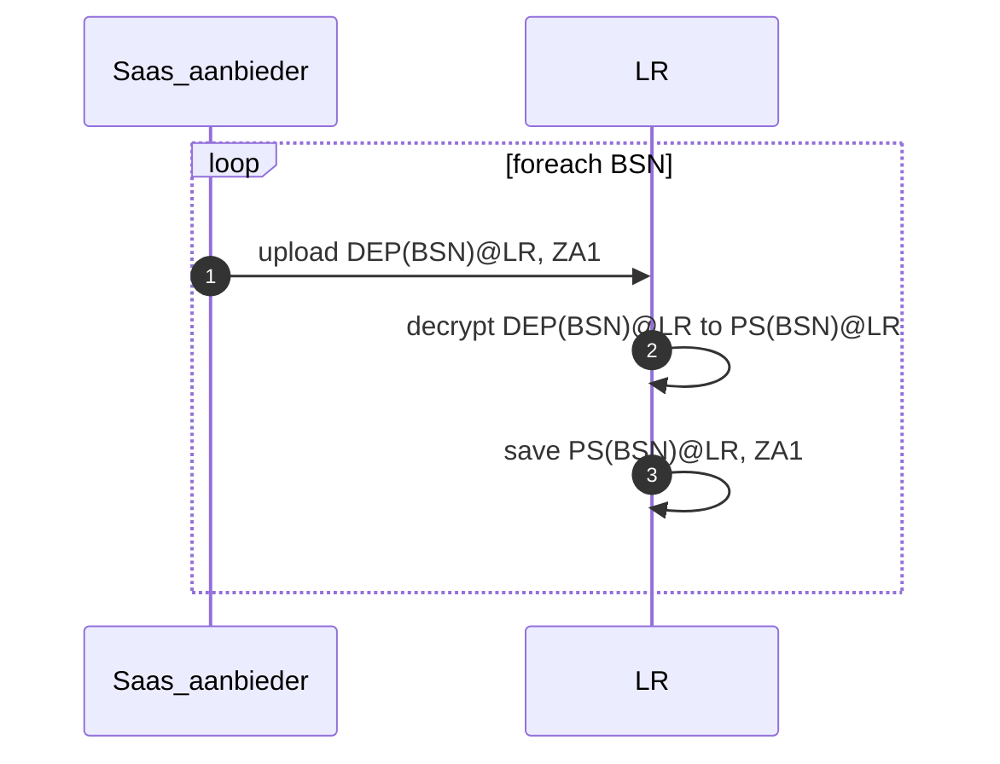
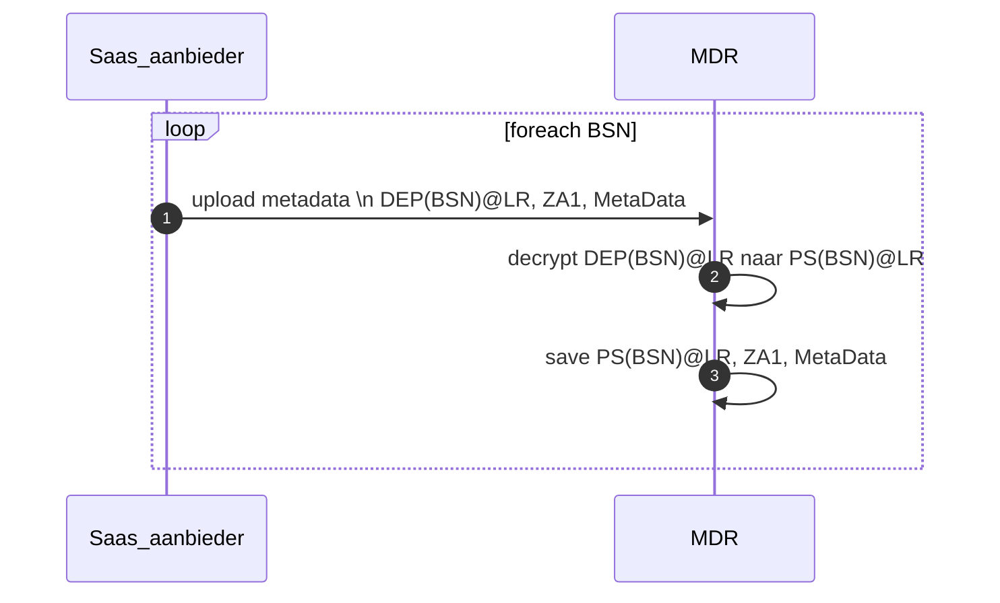
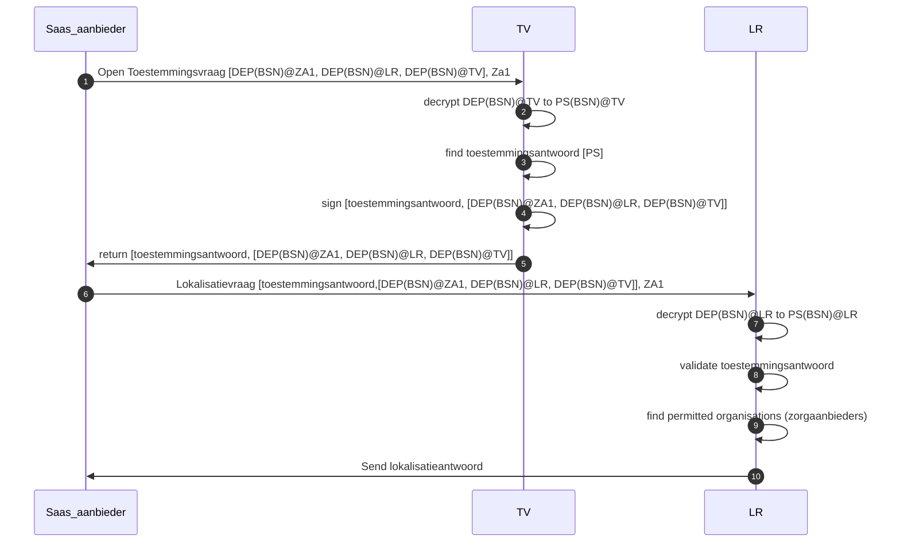

# Setup zorgaanbieder in BSNk stelsel

# Opvragen DEP's op basis BSN’s
Voor de meest voorkomende partijen DEPs opvragen zodat die direct beschikbaar zijn in een interactie met het LokalisatieRegister (LR), ToestemmingsVoorziening (TV).

Aanvragen DEP’s voor zelf (ZA1): Om tot het eigen Pseudoniem (PS) te komen moet er eerst een DEP@ZA1 opgevraagd worden en vervolgens worden ge-decrypt met eigen sleutelmateriaal.

# Aanmelden BSN:ZA1 in LokalisatieRegister (LR) tbv 'WAAR' vraag

# Aanmelden Metadata voor BSN:ZA1 in MetaDataRegister (MDR) tbv ‘gepersonaliseerde welke’ vraag

# 'WAAR' vraag stellen aan LokalisatieRegister (LR) op basis toestemming

