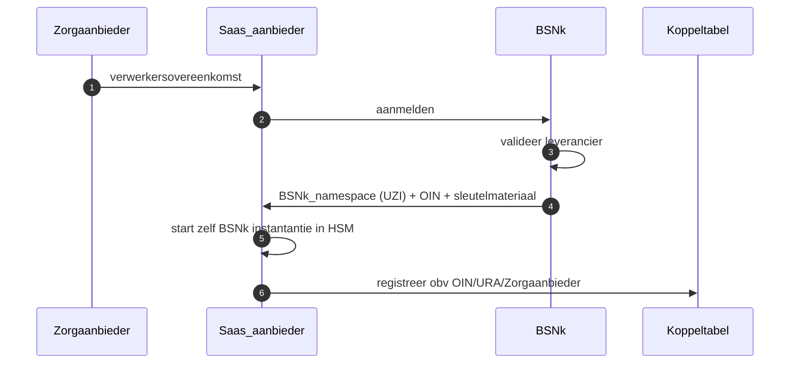
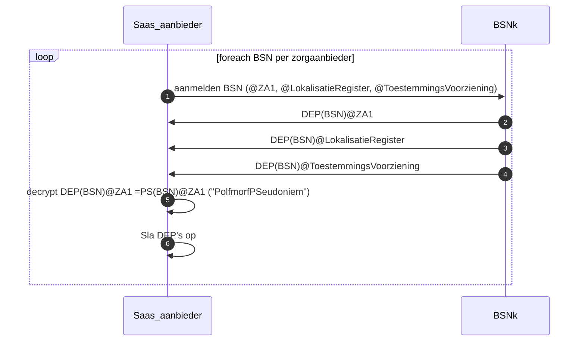
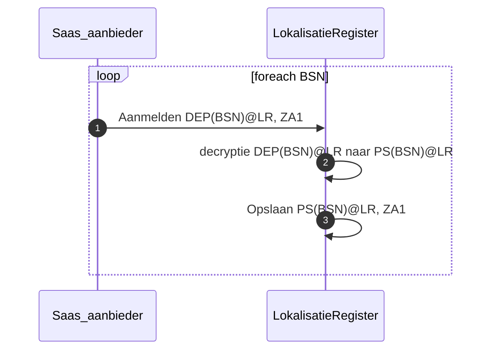
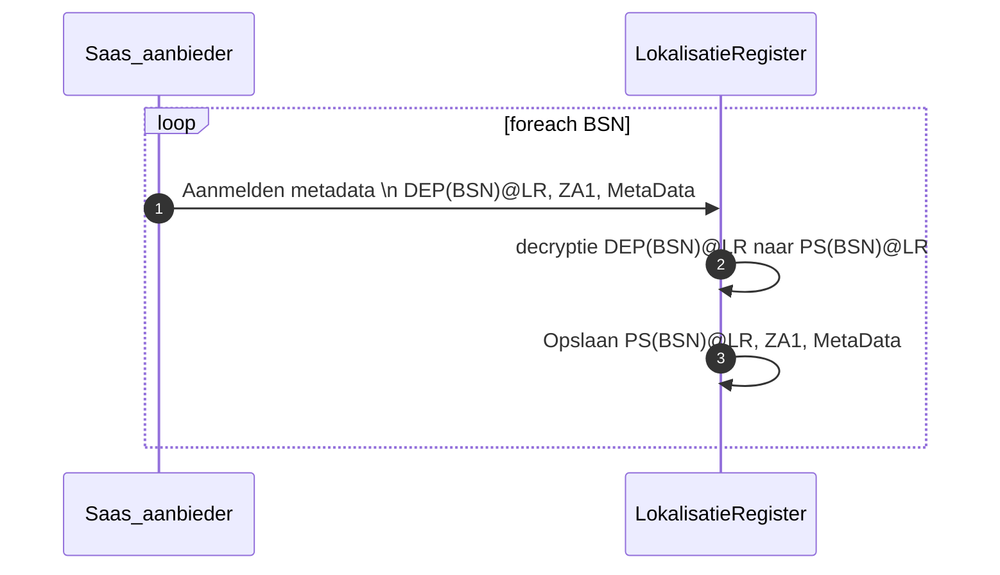

# Setup zorgaanbieder in BSNk stelsel

# Aanmelden BSN’s en opzetten naar DEPs
Voor de meest voorkomende partijen DEPs opvragen zodat die direct beschikbaar zijn in een interactie met het LokalisatieRegister, Toestemmingsvoorziening.

Om tot het eigen Pseudobiem (PS) te komen moet er eerst een DEP@ZA1 opgevraagd worden en vervolgens worden ge-decrypt met eigen sleutelmateriaal.

# Aanmelden BSN:ZA1 in LokalisatieRegister

# Aanmelden Metadata voor BSN:ZA1 in Lokalisatieregister

