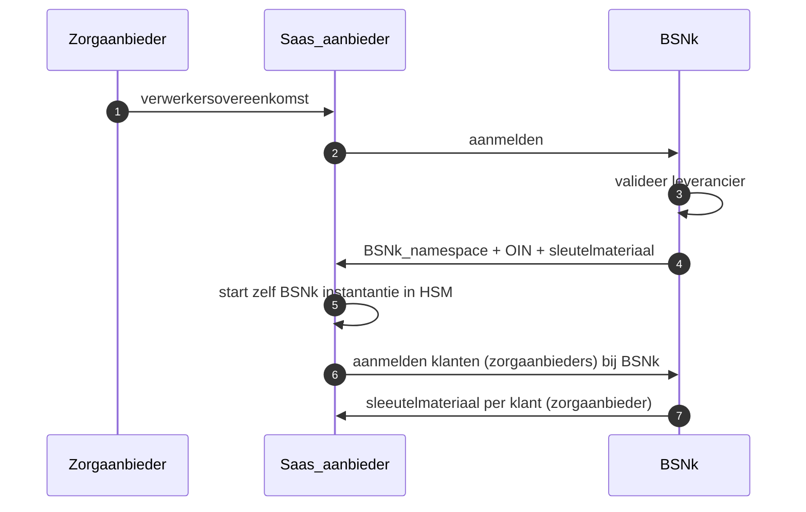
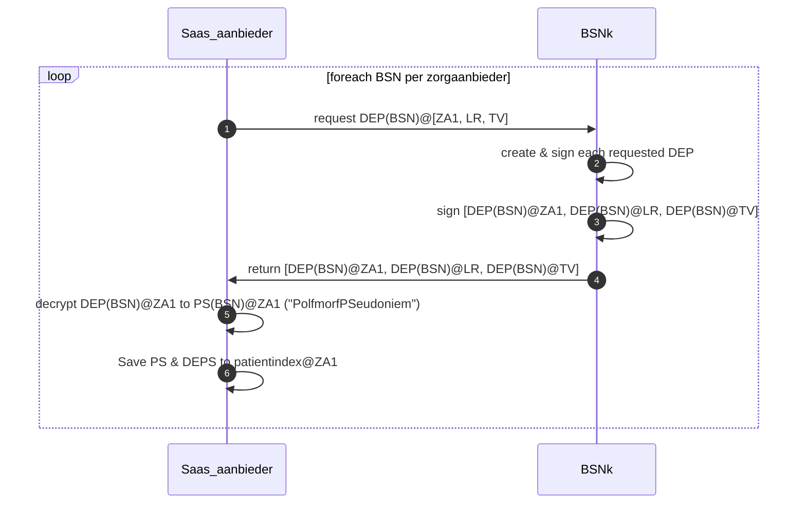
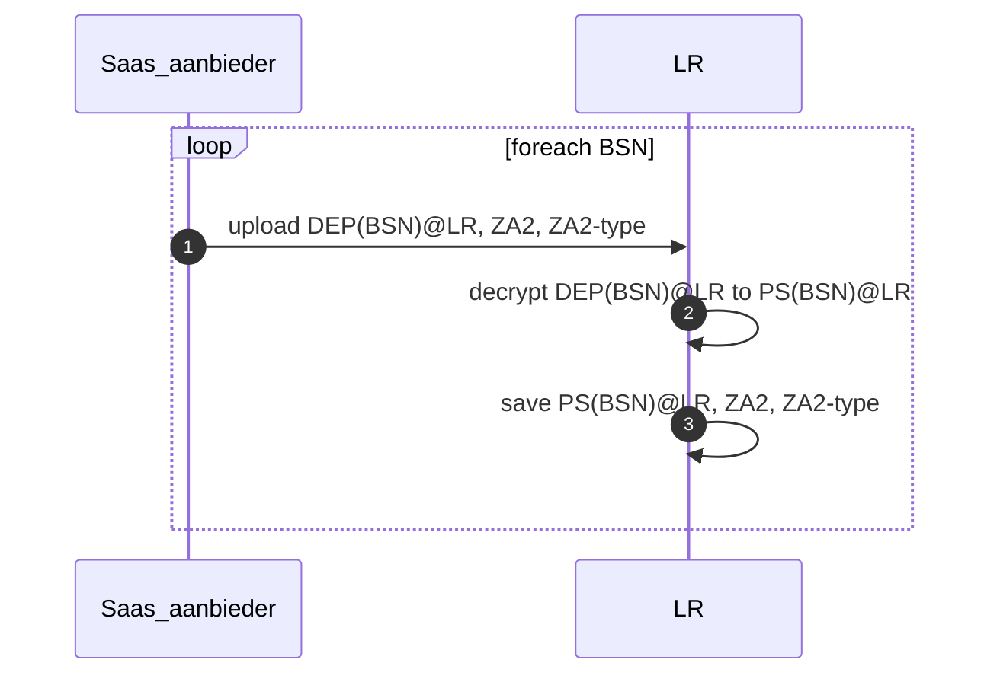
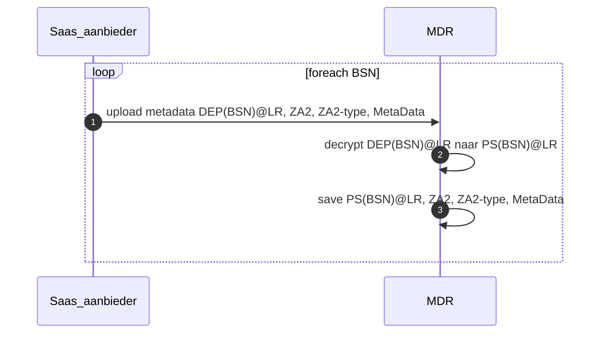
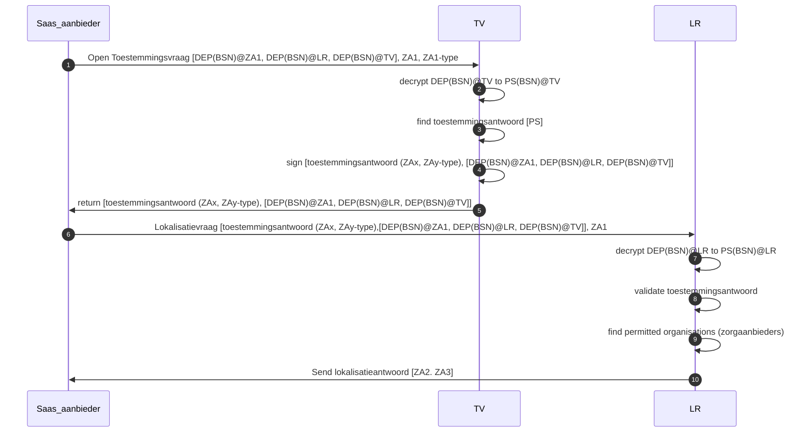
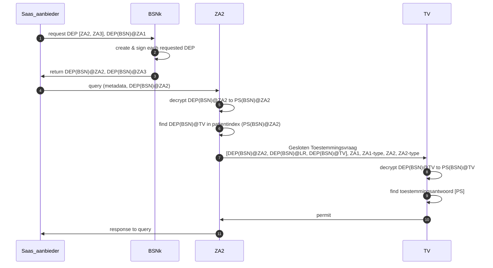
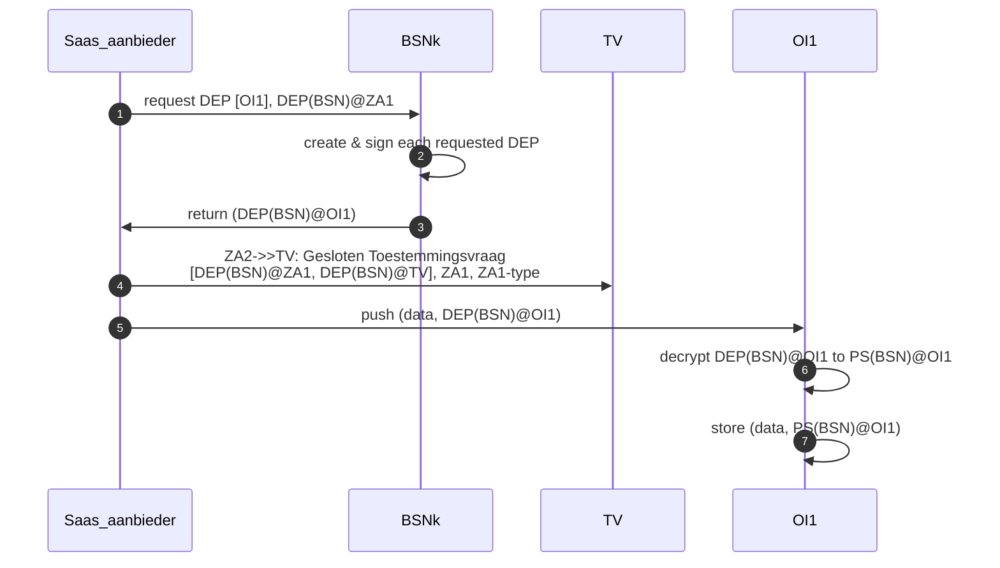
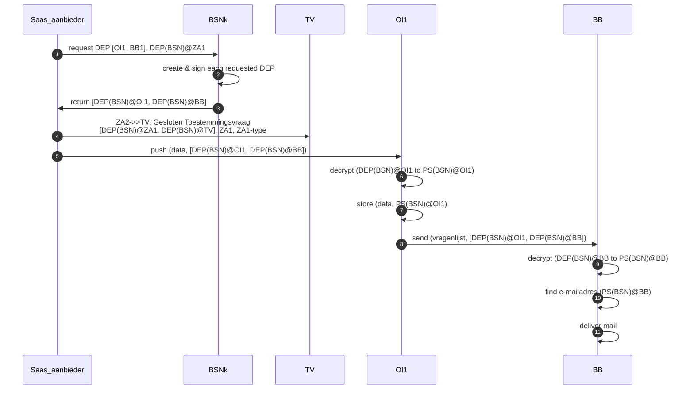
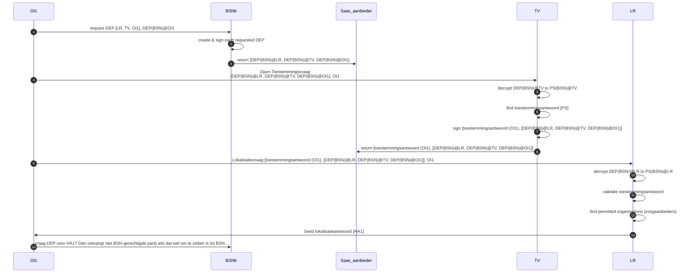

# Algemeen
## Setup Saas_aanbieder in BSNk stelsel

### openstaande vragen": Hoe zet ZA URA om naar OIN/ hoe verkrijgt ZA OIN, Hoe kan saas_aanbieder gemachtigd worden (vragen aan BSNk en CIBG)?

## Opvragen DEP's op basis BSN’s van ingeschreven patienten (door raadplegers en bronhouders)
Voor de meest voorkomende partijen DEPs opvragen zodat die direct beschikbaar zijn in een interactie met het LokalisatieRegister (LR), ToestemmingsVoorziening (TV).

Aanvragen DEP’s voor zelf (ZA1): Om tot het eigen Pseudoniem (PS) te komen moet er eerst een DEP@ZA1 opgevraagd worden en vervolgens worden ge-decrypt met eigen sleutelmateriaal.

# use-case Ia
## Aanmelden BSN:ZA2 in LokalisatieRegister (LR) tbv 'WAAR' vraag

## Aanmelden Metadata voor BSN:ZA2 in MetaDataRegister (MDR) tbv ‘gepersonaliseerde welke’ vraag

## 'WAAR' vraag stellen aan LokalisatieRegister (LR) op basis toestemming

# use-case Ib

# use-case IIa: onderzoeksdata versturen naar onderzoeksinstituut 1 (OI1)

# use-case IIb: onderzoeksdata versturen naar onderzoeksinstituut 1 (OI1) en vragenlijst naar berichtenbox (BB)

# use-case IIc: Onderzoeksinstituut wil op basis ontvangen data aanvullende vragen stellen aan bv Huisarts of apotheek

1) lokalisatie Huisarts/apotheek (mag niet-bsn gerechtigde partij OI1 DEPjes aanvragen voor LR?: vraag aan BSNk)
2) Vraag DEP aan voor Huisarts/apotheek (via ZA1 die data aanleverde of mag niet-bvn gerechtigde partij OI1 DEPjes aanvragen voor Huisarts/Apotheek).
3) Query aan Huisarts/apotheek
4) Huisarts/apotheek checked toestemming
5) Huisarts/apotheek levert gegevens aan
