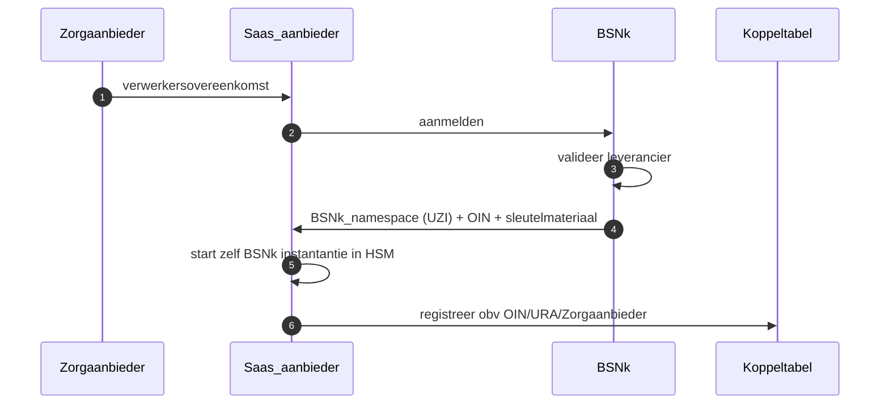
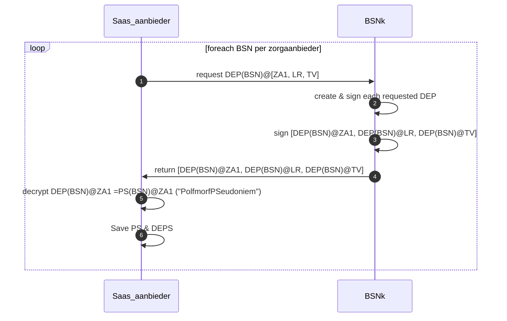
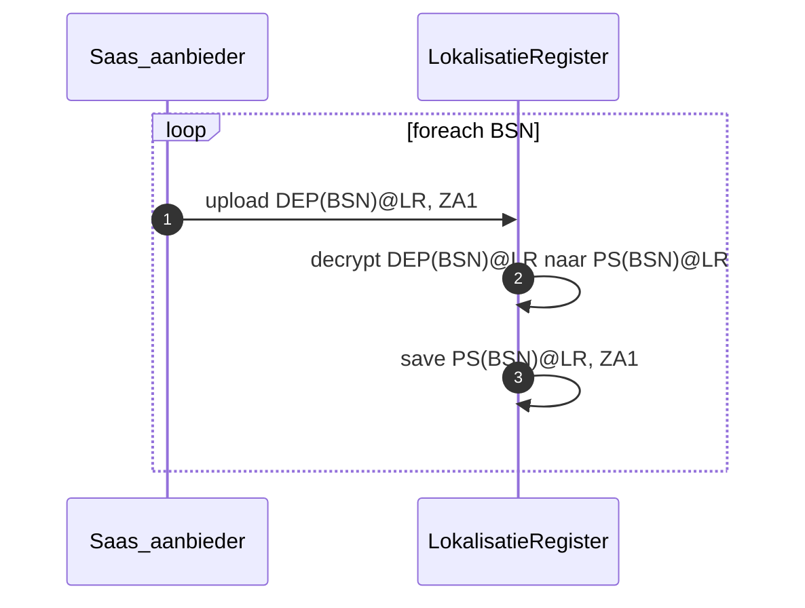
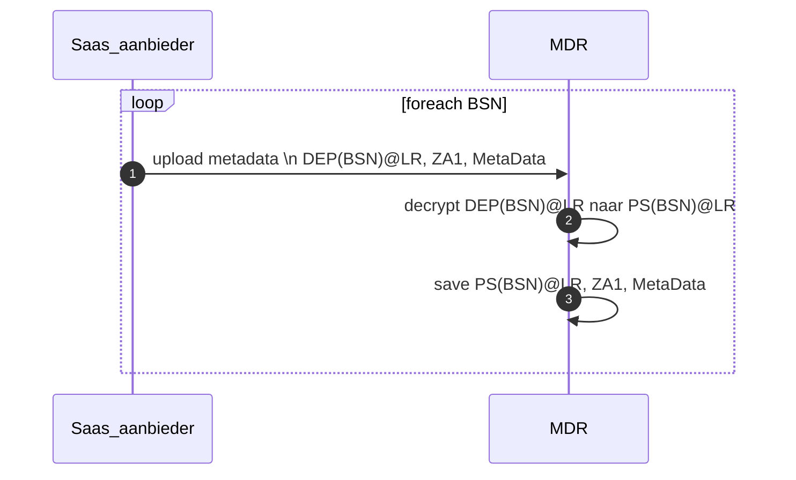

# Setup zorgaanbieder in BSNk stelsel



# Aanmelden BSN’s en opzetten naar DEPs
Voor de meest voorkomende partijen DEPs opvragen zodat die direct beschikbaar zijn in een interactie met het LokalisatieRegister (LR), ToestemmingsVoorziening (TV).

Aanvragen DEP’s voor zelf (ZA1): Om tot het eigen Pseudobiem (PS) te komen moet er eerst een DEP@ZA1 opgevraagd worden en vervolgens worden ge-decrypt met eigen sleutelmateriaal.



# Aanmelden BSN:ZA1 in LokalisatieRegister tbv 'WAAR' vraag


# Aanmelden Metadata voor BSN:ZA1 in MetaDataRegister (MDR) tbv ‘gepersonaliseerde welke’ vraag


# 'WAAR' vraag stellen aan LokalisatieRegister (LR)

```mermaid
sequenceDiagram
autonumber
Saas_aanbieder ->> ToestemmingsVoorziening: Open Toestemmingsvraag+DEP(BSN)LR+DEP(BSN)@TV, Za1?
ToestemmingsVoorziening ->> Saas_aanbieder: toestemmingsantwoord + DEP(BSN)@TV (signed)
Saas_aanbieder ->> LokalisatieRegister: Lokalisatievraag \n DEP(BSN)@LR, toestemmingsantwoord, ZA1
LokalisatieRegister ->> LokalisatieRegister: decryptie DEP(BSN)@LR naar PS(BSN)@LR
LokalisatieRegister ->> LokalisatieRegister: valideer toestemmingsantwoord
LokalisatieRegister ->> LokalisatieRegister: zoek bijbehorende ZA's waar toestemming voor is
LokalisatieRegister ->> Saas_aanbieder: Stuur antwoord op \n DEP(BSN)@ZA1, LR, ZA's
end
```
